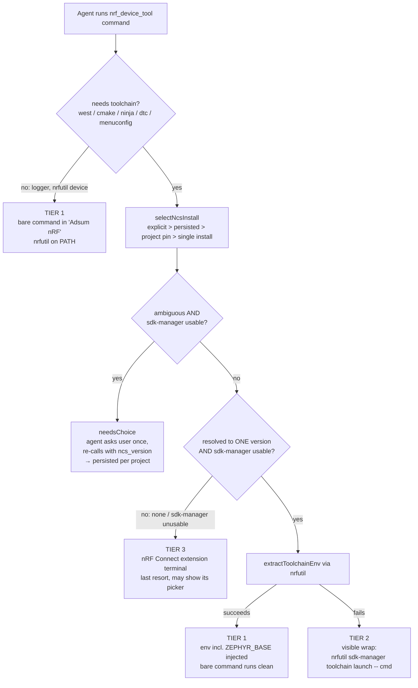
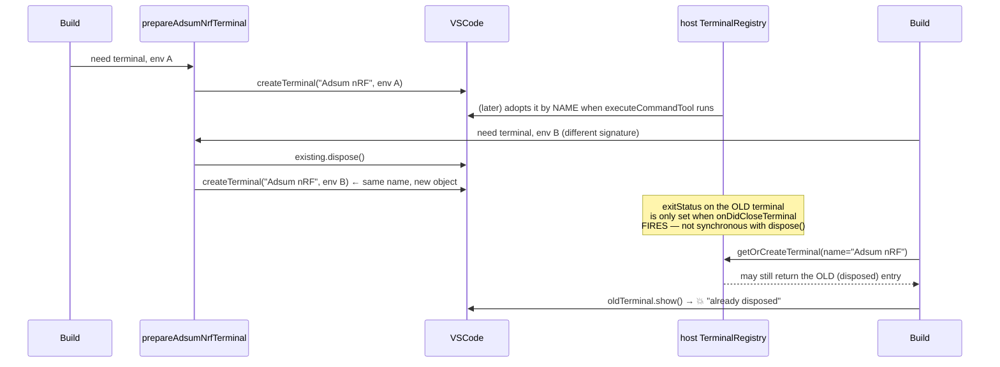
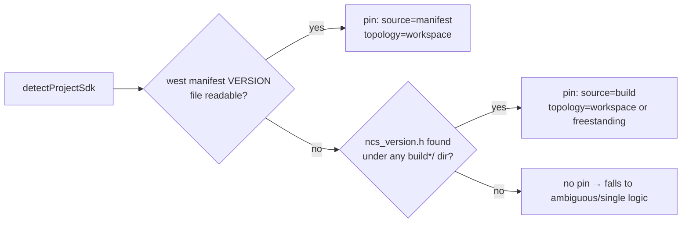

# Adsum nRF terminal — current architecture (uncommitted, F5 testing)

Reference doc only, not shipped. Mirrors the actual code in `executeNordicCommand.ts` / `nordicEnvResolver.ts` / `TriggerNordicActionHandler.ts`.

**FIXED:** `ambiguous` no longer falls to Tier 3. It now returns `needsChoice` → the agent asks you once → re-calls with `ncs_version` → persisted per project. The extension's own picker should no longer appear on a blank "create prototype" with 2+ NCS installed.

## Tier selection

## Why it still falls to the nRF terminal (Tier 3)

Only when we genuinely cannot self-source — no real choice to make ourselves:

| Case | Why |
|---|---|
| Zero NCS versions detected by `sdk-manager` | `none` — nothing to pick from |
| `nrfutil sdk-manager` itself not resolvable | can't self-source at all |

**Ambiguous (2+ NCS, no pin) no longer lands here** — it's now handled by our own ask-once flow (`needsChoice`) instead of deferring to the extension's picker.

Once a project *is* open, `selectNcsInstall` finds a pin (build artifact or west manifest) → resolves to one version → Tier 1/2, no picker, stays in `Adsum nRF`. That part was already working as designed.

## FIXED: "Terminal has already been disposed"

Root cause: two **independent** terminal trackers existed for the same physical terminal —
ours (`_adsumNrfTerminal` in `executeNordicCommand.ts`) and the host's own `TerminalRegistry`
(used by `executeCommandTool` to look the terminal up **by name** right after we hand it back).

Fix: `prepareAdsumNrfTerminal` now **awaits** `onDidCloseTerminal` for the old terminal before
creating its same-named replacement, so the registry never sees a same-named pair where one is
already dead. Only adds latency on the (uncommon) path where the env actually changes — the
common reuse path is untouched.

## Version pin source (project open case)

Not a guess — it's read from an actual file (manifest pin or compiled build header), never inferred.
