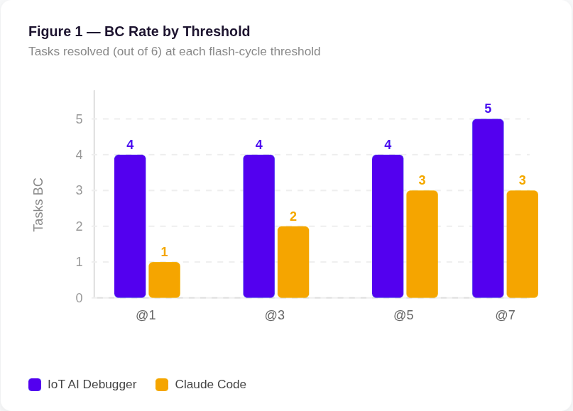
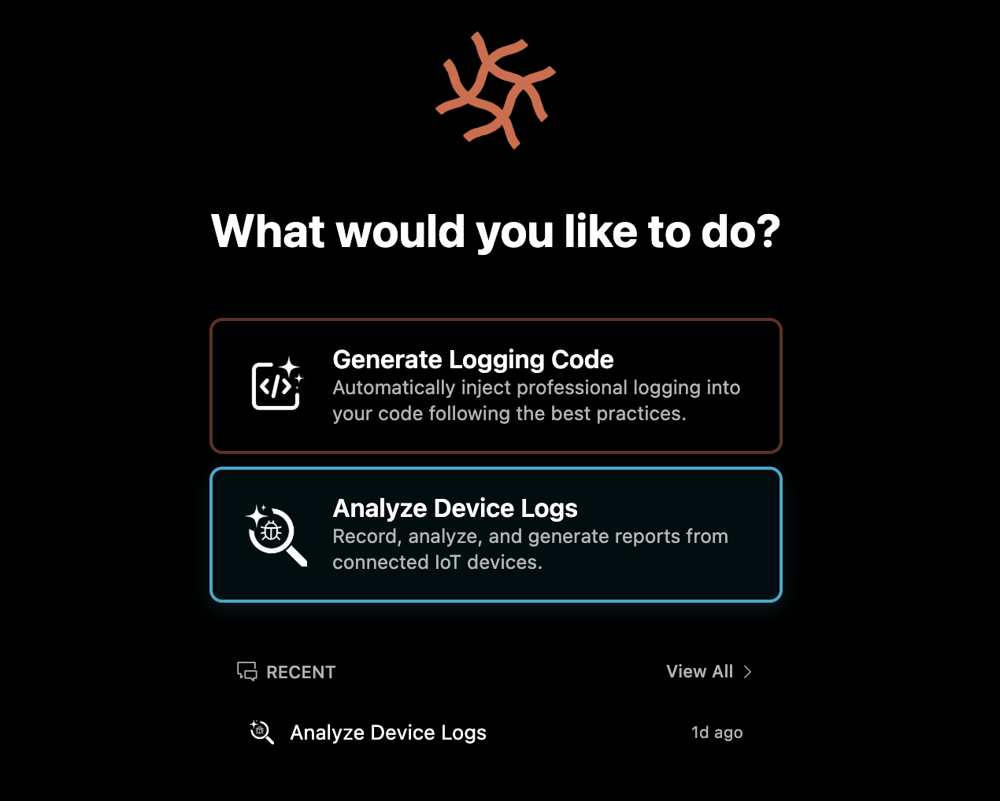

<div align="center">


# Adsum IoT Coder – for nRF

**An open-source AI coding agent that diagnoses and fixes BLE, GATT, and NCS
configuration bugs in fewer flashes — with live device-log capture,
curated nRF Connect SDK knowledge, and an open benchmark proving it works.**

Currently shipping for the **nRF5x** family with **BLE**. Open source under Apache 2.0.

<!-- TODO: Marketplace slug `nrf-ai-debugger` is legacy from v1; pending migration to a new slug aligned with the Adsum IoT Coder name. All marketplace links across this README and package.json should be updated together. -->
<!-- TODO: GitHub repo slug `adsumnetworks/SoC-AI-Debugger` is legacy from v1; pending repo rename to `adsumnetworks/Adsum-IoT-Coder`. Update all github.com/adsumnetworks/SoC-AI-Debugger links in this README together. -->
<p>
  <a href="https://marketplace.visualstudio.com/items?itemName=AdsumNetwork.nrf-ai-debugger"></a>
  <a href="https://marketplace.visualstudio.com/items?itemName=AdsumNetwork.nrf-ai-debugger"></a>
  <a href="https://github.com/adsumnetworks/SoC-AI-Debugger/stargazers"></a>
  <a href="./LICENSE"></a>
  <a href="https://github.com/adsumnetworks/SoC-AI-Debugger/discussions"></a>
  
  
  
</p>

**[Install →](#getting-started)** · **[Benchmark →](#benchmark--iot-firmwaredebugbench-v01)** · **[Architecture →](#architecture--dynamic-knowledge--tool-skill-loading)** · **[Roadmap →](#roadmap)**

<!-- TODO: Replace with updated demo GIF showing "Adsum IoT Coder" branding -->
<p></p>

</div>

---

## Contents

1. [Why Adsum IoT Coder exists](#why-adsum-iot-coder-exists)
2. [Architecture — Dynamic Knowledge & Tool-Skill Loading](#architecture--dynamic-knowledge--tool-skill-loading)
3. [Benchmark — IoT-FirmwareDebugBench v0.1](#benchmark--iot-firmwaredebugbench-v01)
4. [Getting Started](#getting-started)
5. [Roadmap](#roadmap)
6. [Limitations](#limitations)
7. [Citing this work](#citing-this-work)
8. [About](#about)
9. [Contributing](#contributing)
10. [Privacy & Security](#privacy--security)
11. [Troubleshooting](#troubleshooting)

---

## Why Adsum IoT Coder exists

Adsum IoT Coder specialises in **IoT communication firmware** — wireless protocol stacks (Bluetooth Low Energy / BLE today; Wi-Fi, Thread, Matter, LTE-M on the roadmap) and the related power-budget concerns that come with them. This is not a general embedded-systems agent: it isn't trying to help you write a motor controller or a DSP pipeline. It is built for the specific class of bugs that show up in connected devices.

That class of bug fails general coding agents for structural reasons — not model capability. The problems live outside the source code:

- A `settings_load()` call missing after `bt_enable()` compiles fine, connects fine, and silently breaks GATT notifications after the first reconnect.
- An advertising filter with an empty accept list makes the device scannable but impossible to connect to — with zero errors in the log.
- A Central/Peripheral connection-parameter mismatch only surfaces when you correlate timestamps across two separate log streams.
- A BLE peripheral that pairs cleanly under test but drops bond state every cold boot because `CONFIG_BT_SETTINGS` is set without flash storage backing it.
- An advertising interval that fits the radio spec but blows the battery budget on the first field deployment.

None of these are visible in the source code; all of them are common in real BLE/IoT projects. Diagnosing them requires capabilities general coding agents don't have.

### What an IoT-communication debugging agent needs

Four capability pillars — split between what ships today and what's on the roadmap:

| Pillar | Today (shipping) | Roadmap |
|:---|:---|:---|
| **Native SDK integration**<br/>General coding agents read source; they don't drive the NCS toolchain. | nRF Connect SDK v3.2.1, Zephyr build/flash, board-aware project assessment | Older NCS LTS versions, ESP-IDF |
| **Hardware-in-the-loop instrumentation**<br/>Most IoT failures only show in physical signals from the chip — not files in your repo. | Live RTT/UART log capture, J-Link control, multi-device simultaneous capture and correlation | BLE sniffer (Wireshark / nRF Sniffer), PPK II power profiling, spectrum analysis |
| **Expert-reviewed IoT comms knowledge**<br/>The "I've seen this failure before" pattern recognition that takes senior engineers years to build, curated as modules. | BLE protocol stack, NCS/Zephyr internals (Kconfig, settings/bonding, BLE lifecycle traps), nRF5x board specifics, curated BLE failure-mode library | Wi-Fi, Thread, Matter, LTE-M, DECT NR+ protocol modules; power-budget analysis; low-power optimization; protocol-correctness review |
| **Tool-use skills for IoT debugging**<br/>Knowing *when* to flash vs. recheck logs vs. spin up another tool is itself expertise. | `log-analyzer`, `log-generator`, `debug-loop` workflows; discrete `capture-logs` / `analyze-logs` / `build` / `flash` actions — each loaded only when the task calls for it | Additional workflows as new protocols and HITL tooling land |

---

## Architecture — Dynamic Knowledge & Tool-Skill Loading

### From proof of concept to platform

Adsum IoT Coder is an AI coding agent built on the open-source [Cline](https://github.com/cline/cline) foundation, with IoT-specific knowledge modules and tool-use skills layered on top. Two months ago we shipped the first version — nRF AI Debugger — as a proof of concept to test whether purpose-built AI tooling could meaningfully outperform general coding agents on embedded IoT firmware. The proof of concept got real traction, but v1's architecture loaded its full domain expertise into every session — a static bundle that worked but couldn't grow. Adding nRF9x or nRF7x support meant expanding the bundle. Adding ESP, Thread, or Matter meant the same. The architecture sat on a cliff edge.

This release inverts that. Domain knowledge and tool-use skills are structured as a framework of discrete, composable modules — each scoped to a specific chip family, protocol stack, or debug capability. At session start, the agent assesses what the project is and what the task requires, then fetches the relevant modules on demand.

```
User task ──► Agent assesses project ──► Loads scoped modules ──► Executes
              (chip family,                (only what's needed
               protocol stack,              from iot-knowledge/)
               debug category)
```

The module tree on disk:

```
iot-knowledge/
├── rules/                        # Platform-agnostic agent constraints
│   ├── core.md                   # Universal embedded development rules
│   ├── tool-routing.md           # When to use nRF terminal vs standard shell
│   └── device-identity.md        # Never guess device roles from board type
├── platforms/nrf/                # Adsum IoT Coder – for nRF (shipping)
│   ├── PLATFORM.md               # Master index — what to load and when
│   ├── boards/                   # Per-SoC: nRF52840, nRF52832 (nRF5x today)
│   ├── sdks/ncs/                 # NCS project structure, Kconfig, BLE stack
│   │   ├── protocols/BLE.md      # BLE-specific modules
│   │   └── SDK.md                # NCS-specific modules
│   ├── workflows/                # Entry-point sequences (start here)
│   │   ├── log-analyzer.md       # Capture → Analyze → Report
│   │   ├── log-generator.md      # Instrument firmware with LOG_* macros
│   │   └── debug-loop.md         # Build → Flash → Capture → Analyze → Fix
│   └── actions/                  # Subroutines (loaded by workflows only)
│       ├── capture-logs.md
│       ├── analyze-logs.md
│       ├── build.md
│       └── flash.md
└── platforms/esp/                # Adsum IoT Coder – for ESP (roadmap)
```

Analyzing a UART log drop loads `log-analyzer.md` + `capture-logs.md` + `sdks/ncs/SDK.md`. Debugging a failed BLE connection on a two-board setup also pulls in `BLE.md`, `device-identity.md`, and the relevant board file — and nothing else. The model gets exactly what the task requires, no more.

The bigger payoff isn't just avoiding context overflow — it's **context quality**. Even when a full static bundle would technically fit, loading only the relevant modules keeps domain knowledge in the model's effective working set rather than letting it get buried under unrelated material as the session grows. This is the "lost in the middle" failure mode the benchmark caught Claude Code hitting on L1-T2 — same model, full 200k window, lost the original symptom by debug cycle four.

### Human-curated, not AI-generated

A common trend in AI tooling is letting agents author and refine their own tool-use skills. For high-stakes IoT debugging, we've seen the opposite work better: every module in `iot-knowledge/` is hand-authored or hand-reviewed by senior IoT engineers. Expert-curated modules resolve more tasks at lower token cost than AI-generated equivalents — an effect we observed in our own evaluations and one documented at scale in the research that inspired our benchmarking methodology ([arXiv:2603.19583](https://arxiv.org/abs/2603.19583)). AI-generated skills accumulate plausible-but-wrong patterns faster than they accumulate validated ones; expert curation is the bottleneck that keeps the quality bar honest.

---

## Benchmark — IoT-FirmwareDebugBench v0.1

> **5/6 vs 3/6 tasks. 3.8× more token-efficient. Same model — Claude Haiku 4.5.**

A clean architecture is only useful if it produces measurably better outcomes. Standard SWE benchmarks don't exercise hardware-in-the-loop work, and there is no established public benchmark for AI agents on embedded IoT firmware. We adapted methodology from recent research on expert-skill-augmented LLM evaluation for embedded code generation ([arXiv:2603.19583](https://arxiv.org/abs/2603.19583)) and built one — published open source as a deliverable equal in importance to the tool itself.

**[IoT-FirmwareDebugBench v0.1](./docs/benchmarks/v0.1-report.md)** runs on real nRF52840 DK and nRF52832 DK boards with NCS v3.2.1 (Zephyr 4.2.99). Six BLE-focused tasks across three difficulty levels, each with a precisely injected bug, defined reproduction procedure, and known correct fix. The most important methodological choice: **both agents run the same model — Claude Haiku 4.5**, with reasoning mode disabled and prompt caching enabled identically. This isolates a single variable — domain architecture. If Adsum IoT Coder outperforms, it is not because it has access to a more capable model; it is because the architecture wraps the same model differently.

**Difficulty levels.** **L1** — root cause readable directly from logs. **L2** — requires inference from BLE behavior or Kconfig dependencies. **L3** — requires correlating state across two devices or full session timelines.

> *A "flash" in the metric table below = one agent attempt: propose a fix → build → flash to the device → re-test. BC@k = "Bug Closed within k flashes."*

<div align="center">

<!-- TODO: Update chart with "Adsum IoT Coder" branding -->


</div>

| Metric | Adsum IoT Coder | Claude Code |
|:---|:---|:---|
| BC@1 — resolved on first flash | **4 / 6** | 1 / 6 |
| BC@7 — within seven flashes | **5 / 6** | 3 / 6 |
| L1 (visible in logs) | **2 / 2** | 1 / 2 |
| L2 (inference required) | **2 / 2** | 2 / 2 |
| L3 (cross-device) | **1 / 2** | 0 / 2 |
| Total tokens consumed | **34.3M** | 78.5M |
| Tokens per resolved task | **1.86M** | 7.15M |

**Static Code Fix as a failure mode.** Claude Code skipped log capture on two tasks and diagnosed from source code alone — what the benchmark report classifies as **Static Code Fix (SCF)**: a methodology failure regardless of whether the resulting patch happens to compile. On L3-T1, the resulting fix was indeterminate — the root cause (bond asymmetry) is only visible through cross-device log correlation. The dynamic skill architecture eliminates this failure mode by design: log capture is a first-class step in the loaded workflow, not an optional step the agent might skip under exploration pressure.

Two other patterns worth noting: **context degradation predicted failure** (Claude Code burned 27M tokens on L1-T2 and lost the original symptom by the later debug cycles; Adsum IoT Coder resolved it at 148.7k peak), and **the gap widens with task difficulty** (parity at L2, Adsum 1/2 vs 0/2 at L3). Full per-task breakdown in the [benchmark report](./docs/benchmarks/v0.1-report.md).

<div align="center">

<!-- TODO: Update chart with "Adsum IoT Coder" branding -->


</div>

The architecture and the benchmark are two halves of the same commitment: domain-specific AI tooling clean enough to extend, and measurable enough to defend. Run the benchmark yourself. Compare against your own agent. That's the conversation we want to be in.

→ [Full benchmark report](./docs/benchmarks/v0.1-report.md)

---

## Getting Started

Open the VS Code **Extensions** panel and search for **Adsum IoT Coder**, then click Install. Or install from the [VS Code Marketplace](https://marketplace.visualstudio.com/items?itemName=AdsumNetwork.nrf-ai-debugger) directly.

CLI alternative:

```sh
code --install-extension AdsumNetwork.nrf-ai-debugger
```

See [changelog.md](./changelog.md) for release notes.

Configure an AI provider, and open your NCS project. The agent starts with two entry-point workflows:

<!-- TODO: Replace with updated screenshot showing "Adsum IoT Coder" branding -->
<p></p>

**Analyze nRF Device Logs** — captures live RTT/UART logs from connected boards, runs code-aware analysis, produces structured reports. Auto-detects boards via J-Link, supports multi-device simultaneous capture, correlates output with your source code and configuration.

**Generate Logging Code** — reads your NCS project, understands the BLE stack, and injects `LOG_*` macros following Zephyr best practices. An agent that wrote the log statements analyzes the output more intelligently — it understands the context because it created it.

From analysis results, the agent can enter a **Debug Loop** — iterative Build → Flash → Capture → Analyze → Fix cycle — continuing until the bug is resolved or you stop it.

### Requirements

| Requirement | Details |
|:---|:---|
| **nRF Connect SDK** | v3.2.1 |
| **Supported SoCs** | nRF5x family (nRF52840, nRF52832) |
| **Supported Protocols** | BLE |
| **VS Code Extension** | [nRF Connect Extension Pack](https://marketplace.visualstudio.com/items?itemName=nordic-semiconductor.nrf-connect-extension-pack) |
| **Python** | 3.8+ (bundled with nRF Connect extension) |
| **AI Provider** | Any OpenAI-compatible endpoint (cloud or local — see [Tested Models](#tested-models)) |

### Tested Models

Try **Claude Haiku 4.5** first — it's what the benchmark was run on. For cost-sensitive long sessions, **DeepSeek-V4-Pro** is our current recommendation.

| Model | Best for | Notes |
|:---|:---|:---|
| **Claude Haiku 4.5** ⭐ | First try / production | Used in the IoT-FirmwareDebugBench evaluation |
| **DeepSeek-V4-Pro** ⭐ | Cost-sensitive long sessions | Larger context window → fewer overflow failures on long debug loops. Cheaper per million tokens than Haiku. Via [OpenRouter](https://openrouter.ai/deepseek/deepseek-v4-pro) or [DeepSeek API](https://api-docs.deepseek.com/). |
| **GLM 5.1** | Worth watching | Previously our cost-sensitive recommendation; DeepSeek-V4-Pro has since outpaced it on performance, context window, and price. Still works as an OpenAI-compatible endpoint. |

> Any OpenAI-compatible endpoint works, provided the model has strong **tool-calling** (function-calling) capabilities. Models without native tool-use support cannot execute hardware actions or debug workflows.

**Configuring a provider.** Open VS Code Settings → search for "Adsum IoT Coder" → set the API endpoint URL and key. Any OpenAI-compatible endpoint is accepted (OpenRouter, DeepSeek API, Anthropic via a compatible gateway, or a local Ollama / LM Studio server).

---

## Roadmap

The product line is **Adsum IoT Coder**, with each release scoped to a specific IoT chip family. "IoT" reflects the focus: communication stacks and the power-budget concerns that come with them — BLE, Wi-Fi, Thread, Matter, LTE-M — rather than generic embedded coding. "Coder" reflects the trajectory: this release ships debugging because that's where general agents fail hardest and the value is most measurable, but the architecture is designed to cover the full IoT communication development lifecycle — design, implementation, verification, and field optimization — as new modules and skills land.

| Category | Current (shipping) | Next (roadmap) |
|:---|:---|:---|
| **Platform release** | Adsum IoT Coder – for nRF | Adsum IoT Coder – for ESP |
| **SoC families** | nRF5x (nRF52840, nRF52832) | nRF7x (Wi-Fi), nRF9x (cellular), ESP32x |
| **Protocols** | BLE | Wi-Fi, Thread, Matter, LTE-M, DECT NR+ |
| **NCS versions** | v3.2.x | v2.9.x LTS, v3.3+ |
| **HITL tooling** | RTT/UART log capture, J-Link multi-device control | BLE sniffer integration, PPK II power profiling, spectrum analysis |
| **Dev-lifecycle scope** | Debugging (capture → analyze → fix loop) | Power-budget review, protocol-correctness review, architectural review, low-power optimization |
| **Benchmark** | v0.1 (6 BLE tasks on nRF5x) | v0.2 (20+ tasks, Copilot comparison, ESP suite) |

The roadmap is shaped by what the community asks for and contributes. [Open an issue, propose a benchmark task, or contribute a knowledge module.](https://github.com/adsumnetworks/SoC-AI-Debugger/issues)

---

## Limitations

We publish what's true today, not what we wish were true.

- **Scope.** Today the tool ships for the nRF5x family with BLE. Other Nordic families (nRF7x, nRF9x) and other vendors (ESP) are roadmap, not shipping. Other protocols (Wi-Fi, Thread, Matter, LTE-M) are roadmap, not shipping.
- **Benchmark scope.** Six tasks is sufficient for a proof-of-concept evaluation, not statistical significance. v0.2 targets 20–30 tasks.
- **SDK coverage.** All benchmark tasks ran on a single NCS version (v3.2.1). Older LTS versions are roadmap items.
- **Single-evaluator scoring.** All benchmark sessions were run and scored by one person. Independent replication is actively welcomed.
- **Comparison breadth.** GitHub Copilot and OpenAI Codex evaluations are planned for v0.2; token visibility on the free tier delayed Copilot from v0.1.
- **Open unsolved task.** L3-T2 (HIDS security mismatch — central requests `BT_SECURITY_L3` MITM, peripheral offers `BT_SECURITY_L1`) remains unresolved by both agents. Diagnosing it requires SMP-layer event correlation invisible from UART alone. BLE sniffer integration (roadmap) is the planned approach.

The methodology is open precisely so others can probe these limits, run independent comparisons, and contribute tasks.

---

## Citing this work

If you reference the benchmark or this work in research, please cite:

```bibtex
@misc{adsumiotcoder2026,
  title  = {IoT-FirmwareDebugBench v0.1: A Hardware-in-the-Loop
            Evaluation Suite for AI IoT Firmware Debugging Agents},
  author = {Adsum Networks},
  year   = {2026},
  url    = {https://github.com/adsumnetworks/SoC-AI-Debugger},
  note   = {Open source under Apache 2.0}
}
```

---

## About

**[Adsum Networks](https://github.com/adsumnetworks)** — 8+ years building IoT solutions on Nordic and other embedded platforms.

We built Adsum IoT Coder because general coding agents leave IoT firmware developers without reliable AI assistance for the hardest debugging scenarios — protocol failures, power-budget violations, and runtime-only bugs that don't show up in source review. Our belief: domain-specific AI tooling needs to be (a) built by engineers who have lived inside the failure modes, and (b) measured against open benchmarks so the value can be defended, not just claimed. Both halves of that conviction are in this release.

---

## Contributing

We welcome new benchmark tasks, knowledge modules, and HITL tool integrations.

- **Knowledge modules** are Markdown files in `iot-knowledge/` following the structure in [Architecture](#architecture--dynamic-knowledge--tool-skill-loading). Add a new protocol, board, or workflow as its own module.
- **Benchmark tasks** follow the format in [`evals/`](./evals/). Each task ships its bug-injection patch, reproduction procedure, and known-correct fix.

[Open an issue](https://github.com/adsumnetworks/SoC-AI-Debugger/issues) to discuss before larger changes, or open a PR directly for small fixes.

---

## Privacy & Security

The agent runs entirely on your machine. Only what the agent explicitly needs reaches your AI provider.

**Sent to the model:**

- Log snippets the agent has captured during the active session
- Source files and Kconfig the agent has opened in this task
- Tool-call results (build output, flash output, device responses)

**Never sent:**

- Files outside the active workspace
- `.env` files, credentials, signing keys, board UUIDs/MAC addresses
- Background workspace scans, idle file watchers, or telemetry from the agent runtime itself

BYOK (Bring Your Own Key) — you control which model and endpoint you trust. Source is fully open and auditable.

> **Local models work.** Any OpenAI-compatible endpoint can be configured, including locally-hosted models via Ollama, LM Studio, or llama.cpp's built-in server — useful for privacy-sensitive projects where data cannot leave the developer's machine. A model with strong native tool-calling is required; small local models often fall short.

**Telemetry.** Anonymous extension activations, tool triggers, and execution errors. Never source code, file paths, chat content, or device logs. Opt out: set `telemetry.telemetryLevel` to `off` in VS Code settings.

---

## Troubleshooting

**Shell integration warning on first run** — restart VS Code and open a new terminal session.

**Linux notifications** — if `ENOENT` errors appear when tasks complete: `sudo apt install libnotify-bin`

**J-Link not detected / board not auto-detected** — confirm the [SEGGER J-Link drivers](https://www.segger.com/downloads/jlink/) are installed and the board enumerates in `nrfjprog --ids`. Re-plug the board and reload the VS Code window.

**Flash command fails** — make sure no other tool (nRF Connect for Desktop, OpenOCD) holds the J-Link interface. Only one process can flash at a time.

**AI provider authentication errors** — verify your API key in the extension settings and that the endpoint URL matches your provider (e.g. `https://openrouter.ai/api/v1` for OpenRouter).

**Model refuses tool calls / returns plain text** — the configured model must support native tool-calling. Models without function-calling support cannot drive hardware workflows. See [Tested Models](#tested-models).

Still stuck? [Open a Discussion](https://github.com/adsumnetworks/SoC-AI-Debugger/discussions) — we read every one.

---

## Acknowledgments

- [Cline](https://github.com/cline/cline) — The open-source AI coding agent this project builds upon.
- The authors of [arXiv:2603.19583](https://arxiv.org/abs/2603.19583) — For their research on expert-skill-augmented LLM evaluation for embedded code generation, which both inspired our benchmarking methodology and grounds our human-curated knowledge approach.

## License

[Apache 2.0 © 2026 Adsum Networks](./LICENSE)

---

*Built by Adsum Networks. Not affiliated with Nordic Semiconductor ASA.*
