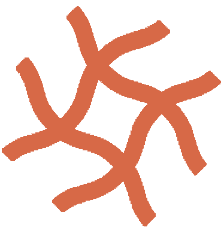
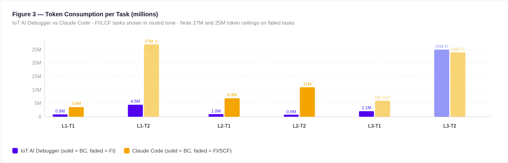
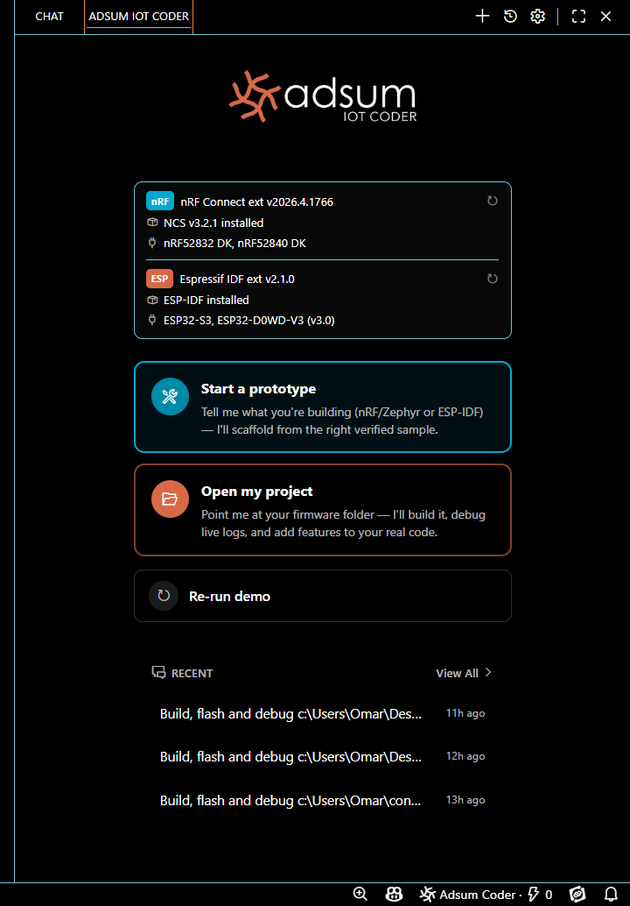
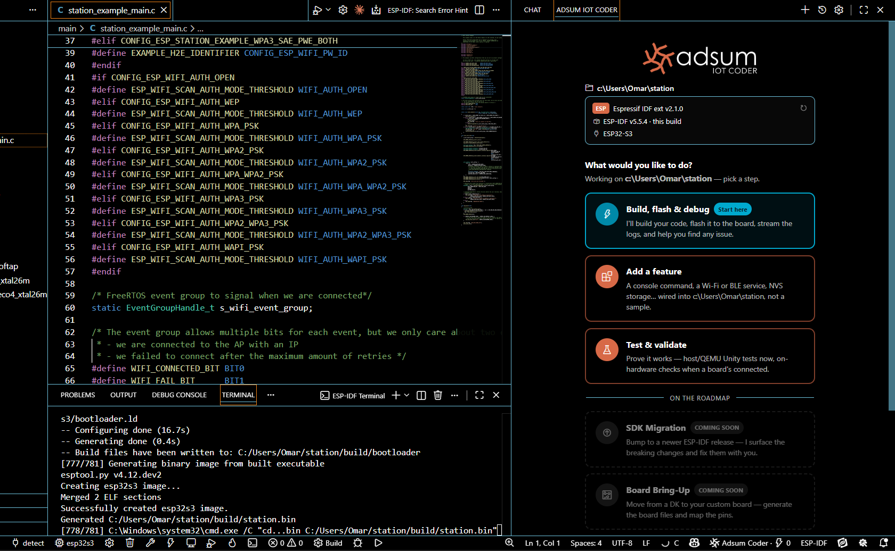

# Adsum IoT Coder

### ESP &amp; nRF · AI Debug &amp; Dev

**An IoT coding agent for VS Code that works your whole firmware dev loop on Espressif ESP and Nordic nRF: scaffold, build, flash, test, observe, fix. It automates the routine firmware work you would rather not do, and cracks the runtime bugs general agents cannot, because it reads your board, not just your code.**

**What makes it different is real human expertise, not just the AI model.** Adsum is augmented with curated firmware knowledge authored by engineers who have shipped, loaded on demand and validated by an [open benchmark](#benchmark) on real hardware. Human-curated, not AI-generated. It is the direction frontier research points to: equip a general model with curated, domain expertise that loads only when needed, rather than scale the model alone. The same approach appears in academic work on expert-skill-augmented models that shaped our benchmark ([arXiv:2603.19583](https://arxiv.org/abs/2603.19583)) and in industry practice ([context engineering](https://www.anthropic.com/engineering/effective-context-engineering-for-ai-agents), [Agent Skills](https://www.anthropic.com/engineering/equipping-agents-for-the-real-world-with-agent-skills)).

**Shipping today:** Espressif ESP32 (incl. S3, C6) on ESP-IDF · Nordic nRF52 / nRF53 / nRF54 on nRF Connect SDK (Zephyr) · BLE and Wi-Fi. Open source under Apache 2.0.

  
  
  
  
  

**[Watch the demo →](https://www.youtube.com/watch?v=67tUybg1phk)** · **[Install →](#getting-started)** · **[Docs →](https://docs.adsumnetworks.com)** · **[Benchmark →](#benchmark)** · **[Contribute →](#contributing)**

---

> **vs Claude Code, same model (Claude Haiku 4.5): 5/6 vs 3/6 bugs closed on real nRF hardware, at 3.8× fewer tokens on average and up to 13× on individual tasks. The edge is architecture, not model scale.**

## What's New `v0.1.6`

 &nbsp;**One extension, now for ESP32 too.** Build, flash, monitor, and test ESP-IDF firmware with the same guided workflows you use for nRF.

 &nbsp;**Automatic platform detection.** The home reads whether your workspace is nRF, ESP, both, or a fresh start, and routes every workflow and the agent's expertise accordingly.

 &nbsp;**Prototyping for both.** *Start a prototype* now scaffolds complete ESP-IDF projects too.

 &nbsp;**Always-current knowledge, leaner install.** Platform expertise is delivered on demand and cached locally, so guidance stays fresh.

 &nbsp;**Stronger Windows support.** Board and toolchain detection across real install layouts, verified on real nRF and ESP hardware.

*Full history in the [changelog](./CHANGELOG.md).*

## Why it exists

Embedded firmware work is two jobs at once: a lot of routine, repetitive setup, and a handful of genuinely hard problems. General coding agents help with neither well, because both live outside the source file.

**The routine you would rather automate:** scaffolding a project, wiring devicetree and Kconfig, generating logging, adding a BLE service or a sensor, writing tests, bringing up a new board. Adsum does this work for you, idiomatically, on both ESP and nRF.

**The hard bugs you cannot grep:** a missing `settings_load()` after `bt_enable()` that silently breaks notifications after a reconnect; an ESP-IDF partition mismatch that only fails at runtime; a fault visible only by correlating logs across two boards. Adsum reads the device, captures the live logs, and works them the way a senior engineer does.

And the reason it is good at the hard parts is the part general agents do not have: **real human expertise.** The firmware knowledge that drives it is authored by engineers who have shipped, loaded on demand, and validated against an open benchmark. Human-curated, not AI-generated.

## What it does: debug, build, and prototype ESP and nRF firmware

- **Automatic platform detection.** nRF, ESP, both, or a fresh start, with the right tools for each.
- **Build, flash & debug.** The full loop on real hardware: build, flash, capture live logs (RTT/UART on nRF, serial monitor on ESP), analyze, fix, repeat.
- **Capture & analyze device logs.** Correlated with your source, across one board or two.
- **Start a prototype, add a feature.** Scaffold a new nRF or ESP-IDF project; wire a BLE service, sensor, shell, or storage into your real project.
- **Test & validate.** Host tests and on-hardware checks.

  

  

## CRA Readiness Check: get CRA-ready as you build

One click runs a build-time readiness check for the **EU Cyber Resilience Act**, on both nRF and ESP. It's a readiness snapshot to help you prepare — **not a conformity assessment, and not legal advice.**

- **SBOM** from your real build (SPDX, machine-readable — the CRA's named artifact).
- **Secure-by-design posture** against your build's actual configuration: secure boot, signed updates, debug-port lock, secure pairing, secure storage, and more — each ✅/⚠️/❌ with the plain-English requirement and what to do, in dependency order.
- **Advisories** for your detected SDK version (links to review — never an automatic verdict).
- **Help you start** closing the top gap (e.g. add a secure bootloader).

It tells you which CRA date applies to you, and writes a `compliance/` folder (report + machine-readable JSON + SBOM). Run it on your firmware, or try it on a bundled sample with nothing open.

## Supported platforms: ESP32 / ESP-IDF and nRF / nRF Connect SDK

| Platform | Chips (today) | SDK | Protocols (today) |
|:---|:---|:---|:---|
| **Nordic** | nRF52, nRF53, nRF54 | nRF Connect SDK (Zephyr) | BLE |
| **Espressif** | ESP32, ESP32-S3, ESP32-C6 | ESP-IDF | Wi-Fi, BLE |
| **Roadmap** | nRF7x (Wi-Fi), nRF9x (cellular) | | Thread, Matter, LTE-M |

## Benchmark

> **Adsum IoT Coder vs Claude Code, same model (Claude Haiku 4.5): 5/6 vs 3/6 bugs, 3.8× more token-efficient on average and up to 13× on individual tasks.**

Both agents ran the same model on real nRF52 hardware, so the gap measures architecture, not model power. Adsum IoT Coder closed 5 of 6 bugs versus Claude Code's 3, using 3.8× fewer tokens on average and as much as 13× fewer on the hardest individual tasks. The benchmark, IoT-FirmwareDebugBench v0.1, is open source. Run it yourself.

| Metric | Adsum IoT Coder | Claude Code |
|:---|:---|:---|
| Bugs closed (within 7 flashes) | **5 / 6** | 3 / 6 |
| Resolved on the first flash | **4 / 6** | 1 / 6 |
| Cross-device tasks (L3) | **1 / 2** | 0 / 2 |
| Tokens per resolved task | **1.86M** | 7.15M |

Full methodology, per-task results, and honest limitations are in the [benchmark report](./docs/benchmarks/v0.1-report.md). Methodology adapted from [arXiv:2603.19583](https://arxiv.org/abs/2603.19583).

## Contributing

That result comes from the expertise the agent runs on, not the model: curated firmware knowledge authored by practicing engineers and validated on real hardware. The agent gets stronger as that knowledge base grows, and there are two ways to get involved, both open to you.

**Contribute knowledge (embedded experts and specialists).** This is the part that makes the agent good, and it is written by engineers, not the model: the hard-won fixes and idioms you only get from shipping nRF and ESP firmware. We are building a dedicated studio for authoring this expertise and will open it to outside specialists once it has earned its keep in-house. If you have lived inside these failure modes and want to shape it as a founding contributor, get credited for your work, and keep the rights to it, [start a discussion](https://github.com/adsumnetworks/Adsum-IoT-Coder/discussions).

**Contribute code (open-source developers).** The extension is open source (Apache-2.0, built on [Cline](https://github.com/cline/cline)). Improve the tool itself, or add a benchmark task in [`evals/`](./evals/). [Open an issue or PR](https://github.com/adsumnetworks/Adsum-IoT-Coder/issues).

## Getting Started

Search **Adsum IoT Coder** in the VS Code Extensions panel, or install from the [Marketplace](https://marketplace.visualstudio.com/items?itemName=AdsumNetwork.nrf-ai-debugger) directly. No key, no account: the free tier is on by default.

**Prerequisites:** the [nRF Connect Extension Pack](https://marketplace.visualstudio.com/items?itemName=nordic-semiconductor.nrf-connect-extension-pack) for nRF work, or an ESP-IDF installation for ESP, plus Python 3.8+. Full requirements are in the [docs](https://docs.adsumnetworks.com/getting-started).

1. Run the built-in **30-second demo** (no board needed) to see the capture, analyze, fix loop on a real BLE bug.
2. Open your **nRF or ESP project**; the home reads it, detects your boards and toolchain, and offers the right one-click workflows.
3. Bring your own model whenever you want; the running task continues, no restart.

## Free tier: put it to work in your first minute, on us

Most tools make you choose a provider, paste an API key, and add a card before you can find out whether they help. We cut all of that.

Install Adsum IoT Coder and it just works. No key, no account, no card. The inference is on us, on a managed model, so you can point the agent at your own firmware in the first minute, not the first hour. It is a real working tier, generous enough to scaffold a project and run a full debug loop, not a locked demo.

When you want your own model or heavier usage, drop in any OpenAI-compatible key (Claude, DeepSeek, or a local model with strong tool-calling) and the switch is instant: the task you are in keeps running, no restart. The free tier is token-metered, and when you reach the limit a one-click prompt moves you onto your own key and the same task picks up exactly where it left off.

|  | Free tier | Bring your own key |
|:---|:---|:---|
| **API key** | Not required | Required |
| **Cost to you** | Nothing, the inference is on us | Your provider's rates |
| **Model** | Managed by Adsum | Any OpenAI-compatible model |
| **Best for** | First run, evaluation, quick fixes | Daily driver, long sessions, model choice |

Recommended for bring-your-own-key: **Claude Haiku 4.5** (the benchmark model) and **DeepSeek-V4-Pro** (cost-effective long sessions). Full setup and tested models in the [docs](https://docs.adsumnetworks.com/models).

## Roadmap

Shipping today: Nordic nRF and Espressif ESP32, with BLE and Wi-Fi. Next: more chips (nRF7x Wi-Fi, nRF9x cellular, more ESP32 variants), more protocols (Thread, Matter, LTE-M), deeper hardware-in-the-loop tooling (BLE sniffer, power profiling), and a growing community knowledge base. The **CRA SBOM & Fix** workflow (EU Cyber Resilience Act readiness) ships in this release; broader CRA tooling follows. The roadmap is shaped by what the community asks for and contributes.

## Limitations

We publish what is true today. **Adsum is an AI-based coding agent and can make mistakes.** The CRA workflow is a readiness aid, not a conformity assessment and not legal advice; only a notified body or your formal assessment establishes conformity. The benchmark is six BLE tasks on a single NCS version: a proof of concept, not statistical significance, and an ESP benchmark suite is on the roadmap (v0.2). nRF, nRF Connect SDK, and Nordic Semiconductor are trademarks of Nordic Semiconductor ASA; ESP32 and ESP-IDF are trademarks of Espressif Systems; Zephyr is a trademark of the Linux Foundation; Visual Studio Code is a trademark of Microsoft. This is an independent project, not affiliated with or endorsed by any of them.

## Privacy & Security

The runtime runs entirely on your machine. Only the log snippets and code context a task needs go to the AI provider you configure. BYOK: you control which model and endpoint you trust. Pseudonymous product analytics only (installs, activations, feature usage, errors), keyed to a random install ID; never your source code, chat content, or device logs. Opt out anytime with `telemetry.telemetryLevel: off`. Source is fully open and auditable.

## About

**[Adsum Networks](https://github.com/adsumnetworks)** has built embedded firmware on Nordic nRF and other SoC platforms for 8 years, living inside the failure modes that cost embedded engineers their days. We built Adsum IoT Coder because general coding agents leave embedded developers without reliable help for the work that fills the day: the routine setup worth automating, and the runtime bugs that never show up in source review. The difference is real human expertise, not just the AI model: curated firmware knowledge authored by engineers who have shipped, loaded on demand and measured against an open benchmark on real hardware, so the value can be defended, not just claimed.

---

**[adsumnetworks.com](https://adsumnetworks.com)** · **[GitHub](https://github.com/adsumnetworks/Adsum-IoT-Coder)** · **[Discussions](https://github.com/adsumnetworks/Adsum-IoT-Coder/discussions)** · **[YouTube](https://www.youtube.com/@adsumnetworks)**

**Open-core** — extension code Apache-2.0 © 2026 Adsum Networks (a derivative of [Cline](https://github.com/cline/cline); see [NOTICE](NOTICE)) · bundled knowledge content CC-BY-SA-4.0 (see [iot-knowledge/LICENSE](iot-knowledge/LICENSE)) · downloaded registry bits are proprietary.

