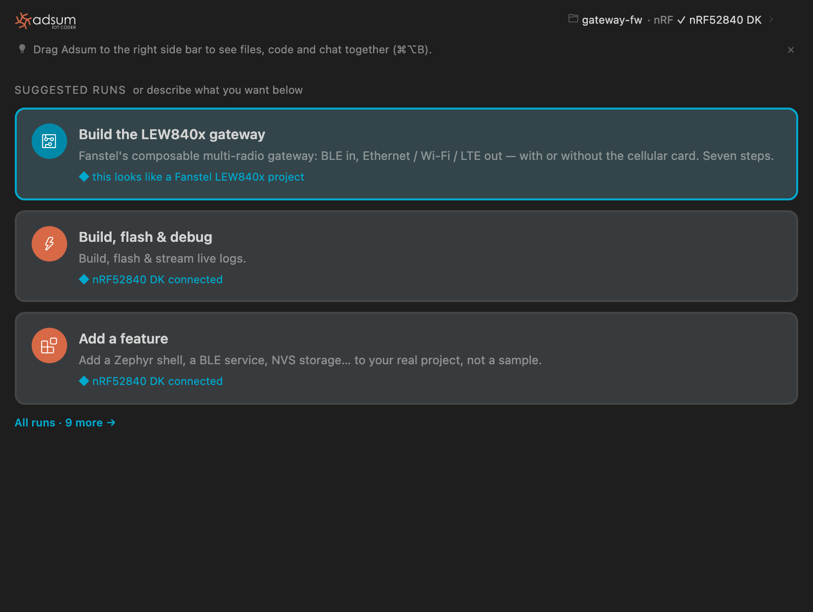
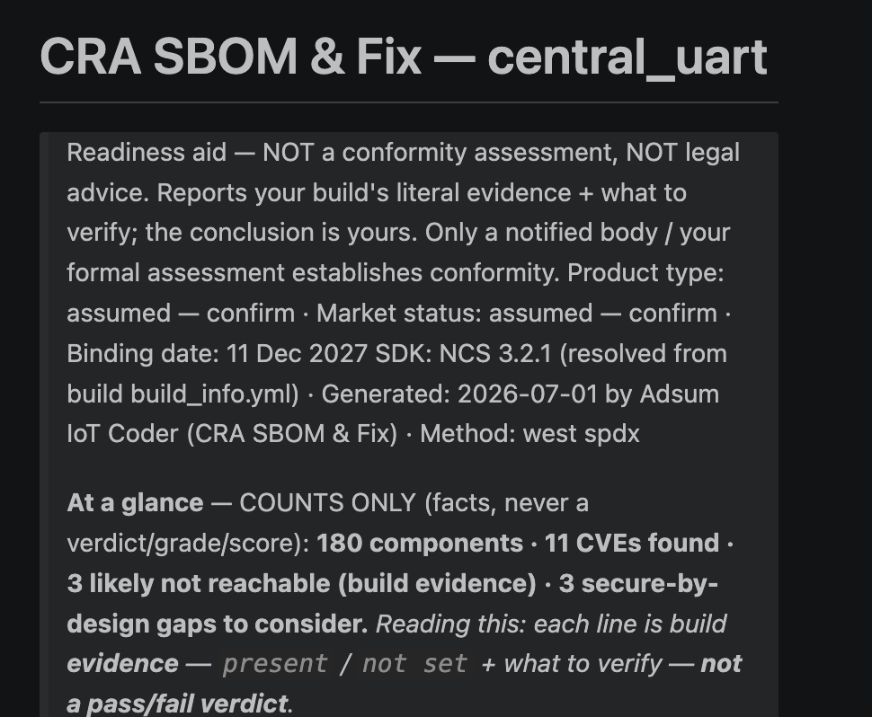

# Adsum IoT Coder

### ESP &amp; nRF · IoT Firmware Debug, Dev &amp; CRA Readiness

**An IoT coding agent for VS Code that works your whole firmware dev loop on Espressif ESP and Nordic nRF: scaffold, build, flash, test, observe, fix. It automates the routine firmware work you would rather not do, and cracks the runtime bugs general agents cannot, because it reads your board, not just your code.**

**What makes it different is real human expertise, not just the AI model.** Adsum is augmented with curated firmware knowledge authored by engineers who have shipped, loaded on demand and validated by an [open benchmark](#benchmark) on real hardware. Human-curated, not AI-generated.

**Shipping today:** Espressif ESP32 (incl. S3, C6) on ESP-IDF · Nordic nRF52 / nRF53 / nRF54L / nRF91 on nRF Connect SDK (Zephyr) · BLE, Wi-Fi, Ethernet, and cellular (NB-IoT, LTE-M, GNSS, satellite NB-NTN) · **one-click EU Cyber Resilience Act (CRA) readiness: an SBOM plus a secure-by-design posture check.** Open source under Apache 2.0.

  
  
  
  
  
  

**[Install →](#getting-started)** · **[Docs →](https://docs.adsumnetworks.com)** · **[CRA readiness →](#cra-readiness-sbom-cve-and-secure-by-design)** · **[Benchmark →](#benchmark)** · **[Contribute →](#contributing)**

*Above: the documented LEW840x run, frame by frame: a written spec, a few questions answered, a running gateway in under an hour.* **[Read that run →](https://docs.adsumnetworks.com/supported-hardware/fanstel/lew840x)** · **[▶ Watch a dual-chip gateway built, debugged and CRA-checked in under 30 minutes →](https://www.youtube.com/playlist?list=PLYh65pF22Elk)**

**No key, no account, no card.** The free tier is on by default: install and see it work on a real bug in your first minute.

---

> **On our open benchmark, running the identical model as Claude Code (Claude Haiku 4.5), Adsum fixed 4× more firmware bugs on the first device flash, at 3.8× fewer tokens on average and up to 13× on individual tasks. Anyone can rerun it.**

## What's New `v0.4.0`

A home that reads your desk, cellular and satellite work behind a free account, and a run you can steer while it works. BLE, Wi-Fi and Ethernet need no account, today or tomorrow.

<table>
<tr>
<td width="58%" valign="top">

 &nbsp;**A home that reads your desk.** One row says what is on it and what is missing (*nRF ✓ nRF52840 DK*, or *no toolchain yet · what to install →*); a device that will not answer is reported there, with *why →*. Then the runs worth starting, ranked, each saying why. Typing in the box is the new session; a named resume is offered whenever the folder has one, and every other session is one click away in the editor's History. [Getting started](https://docs.adsumnetworks.com/getting-started)

 &nbsp;**Gateway firmware you can flash and license.** Signed images and licensed source for the Fanstel LEW840x on BLE, Ethernet and Wi-Fi; a cellular demo on LTE-M / NB-IoT; satellite NB-NTN and nRF54 edge AI with a free account (GitHub or email, no card). The Fanstel BLG20, a BLE 6 terrestrial + non-terrestrial gateway with on-device inference, is next. [Gateway firmware](https://docs.adsumnetworks.com/gateway-firmware)

 &nbsp;**Steer a run without stopping it.** A message sent to a working session lands at its next step. The thinking depth you set for DeepSeek and GLM now reaches the request, DeepSeek prices match the vendor's, and `modelPricing` takes your own rate. [Models](https://docs.adsumnetworks.com/models)

</td>
<td width="42%" valign="top"></td>
</tr>
</table>

**In `v0.3.1`:** nRF91 cellular, the first partner open-hardware gateway, and Tool bits downloaded on demand. **In `v0.2.0`:** a two-chip industrial gateway built, debugged and CRA-checked from one spec **in under 30 minutes**. [Watch the playlist](https://www.youtube.com/playlist?list=PLYh65pF22Elk) · *full history in the [changelog](./CHANGELOG.md).*

## Getting Started

Search **Adsum IoT Coder** in the VS Code Extensions panel, or install from the [VS Code Marketplace](https://marketplace.visualstudio.com/items?itemName=AdsumNetwork.nrf-ai-debugger) or [Open VSX](https://open-vsx.org/extension/AdsumNetwork/nrf-ai-debugger) (Cursor, Windsurf, VSCodium). **No key, no account, no card**: the free tier is on by default and is a real working tier, enough to scaffold a project and run a full debug loop.

**Prerequisites:** the [nRF Connect Extension Pack](https://marketplace.visualstudio.com/items?itemName=nordic-semiconductor.nrf-connect-extension-pack) for nRF, or an ESP-IDF installation for ESP. nRF54LM20 needs nRF Connect SDK 3.3.0 or newer; cellular needs an nRF91 DK and a SIM. [Full requirements](https://docs.adsumnetworks.com/getting-started)

1. Start with a **sample run**, no board needed: a real BLE bug, the same bug one layer deeper with a sniffer and HCI tracing, or a CRA readiness check on a pre-built gateway.
2. Open your **nRF or ESP project**. The home detects your boards and toolchains and ranks the runs worth starting: *Build, flash & debug*, *Add a feature*, *Test & validate*, *CRA SBOM & Fix*, or a guided partner-gateway build.
3. **Describe the task** or pick a run. Enter starts the session; a message sent while it works lands at the next step.
4. **Register (free, no card)** when you reach cellular, satellite or edge AI. Everything else keeps working without it.
5. **Bring your own model** whenever you want: the GLM Coding Plan, Claude, DeepSeek, or any OpenAI- or Anthropic-compatible endpoint, cloud or local, switched instantly on a running task.

Field-tested on our own builds: the budget tiers handle routine work with thinking on; the full models can switch it off, which is where the token saving lives. [Free tier →](https://docs.adsumnetworks.com/free-tier) · [Models →](https://docs.adsumnetworks.com/models)

## Supported platforms: ESP32 / ESP-IDF and nRF / nRF Connect SDK

| Platform | Chips (today) | SDK | Protocols (today) |
|:---|:---|:---|:---|
| **Nordic** | nRF52, nRF53, nRF54L (L15, LM20), **nRF91 (9160, 9161, 9151)** | nRF Connect SDK (Zephyr) | BLE, **NB-IoT, LTE-M, GNSS, NB-NTN** |
| **Espressif** | ESP32, ESP32-S3, ESP32-C6, and the rest of the shipping range | ESP-IDF | Wi-Fi, BLE |
| **Products** | **Fanstel LEW840X, BWG840X** gateways, with their own product knowledge | both, one workspace | BLE, Ethernet, Wi-Fi, cellular |
| **Roadmap** | nRF7x (Wi-Fi), on-device AI on nRF54 / ESP32, Linux devices (NVIDIA Jetson, Raspberry Pi) | | LoRa, 5G / 5G RedCap via hats |

Adsum works on **any board built with a supported chip**: your own design, a reference board, a development kit, or a product off the shelf. There is no list your board has to be on. Cellular, NB-NTN and edge-AI runs, and the gateway firmware below, need a free registered account; nothing else does. NTN firmware is a public download but runs only on an nRF9151 of the LACA A1A revision; DECT NR+ knowledge ships and needs a modem image from Nordic sales. [Chips and protocols](https://docs.adsumnetworks.com/supported-hardware) · [cellular](https://docs.adsumnetworks.com/cellular) · [partner open hardware](https://docs.adsumnetworks.com/supported-hardware/partner-open-hardware)

## Gateway firmware: flash it, license it, extend it

Working firmware for the Fanstel composable LEW gateway, two ways: **signed images** you flash to judge it on your own network, and **licensed source, per module**, so your team owns what it ships. The agent already knows these boards, so extending either is a task, not a project.

| Gateway | Radios | Signed images | Licensed source | You need |
|:---|:---|:---|:---|:---|
| **LEW840x** · BLE to Ethernet / Wi-Fi | BLE in; Ethernet, Wi-Fi out | **Available**: scanner + uplink, unlimited | **Available**, on request | LEW840x · free account |
| **LEW840x** · cellular | + LTE-M, NB-IoT (nRF9160 / 9161) | **Demo**: cellular bearer, 60-minute sessions | On request | + LTE M.2 card, SIM |
| Satellite **NB-NTN** on nRF9151 | NB-NTN | Bring-up run + knowledge | · | nRF9151 DK (LACA A1A) |
| **Edge AI** on nRF54 | On-device inference basics | Knowledge + guided run | · | An nRF54 board |
| **BWG840X** · BLE to Wi-Fi | BLE in; Wi-Fi out | Soon (moving onto the LEW840x code base) | Soon | BWG840X |
| **Next**: Fanstel **BLG20**, BLE 6 terrestrial + non-terrestrial gateway | BLE 6; LTE-M, NB-IoT, NB-NTN; edge-AI inference on the nRF54 NPU | Soon | Soon | Early access, by request |

- **Flash to judge**: register (free), flash, watch tags reach your broker. Wi-Fi and Ethernet unlimited; cellular in 60-minute sessions; needs `nrfutil` and `esptool`.
- **License to ship**: ask for the modules you need from *Settings › Account › Request template source*, or write to support@adsumnetworks.com. Per module, production use, your modifications stay yours; the images are for evaluation.
- **Extend with the agent**: it holds the LEW840x pinouts, connectors and M.2 cards, and runs the CRA check on every build. Verified with nRF Connect SDK 3.2.1, ESP-IDF 5.5, extension 0.4.0.

Fanstel makes and sells the hardware; Adsum writes, signs and licenses the firmware. [Gateway firmware →](https://docs.adsumnetworks.com/gateway-firmware) · [LEW840x walkthrough →](https://docs.adsumnetworks.com/supported-hardware/fanstel/lew840x)

## What it does: debug, build, and prototype ESP and nRF firmware

- **Tells you what is on your desk.** Names your board, says which toolchain is missing and what to install, and when a serial device will not answer it says so in the header, with the why one click away.
- **Carries a full product build.** One spec to a working two-chip gateway, across both toolchains, in under 30 minutes, you approving each step. [Walkthrough](https://docs.adsumnetworks.com/ble-wifi-gateway)
- **Builds, flashes and debugs on real hardware.** Live RTT and UART logs on nRF, serial on ESP, read against your source. The reset vector is checked before an image is flashed.
- **Debugs across three layers.** App log, HCI bus and over-the-air radio, correlated. [A real one](https://docs.adsumnetworks.com/ble-wifi-gateway/troubleshooting): 36 advertisements on the air, 0 received, a radio front end never switched on.
- **Talks to the board.** AT and Zephyr shell commands, and a modem trace with the network's own reason for refusing a connection.
- **Scaffolds, extends, tests.** A new project, or a BLE service, sensor, shell or storage wired into yours; host tests and on-hardware checks.
- **Remembers and can be steered.** An `.adsum/` project memory read at the start of every task; a message mid-run lands at the next step; any session exports as one redacted file.

## CRA Readiness: SBOM, CVE, and secure-by-design

One click runs a build-time readiness check for the **EU Cyber Resilience Act (CRA)**, on both nRF and ESP. A readiness snapshot to help you prepare, **not a conformity assessment and not legal advice.**

**[▶ Watch the CRA check on a real gateway build →](https://www.youtube.com/watch?v=uwl76c6FuY0)** · **[the run, with its numbers →](https://docs.adsumnetworks.com/ble-wifi-gateway/cra)**

- **An SBOM from your real build.** Machine-readable SPDX, the CRA's named artifact, generated with the vendor-native tools.
- **A known-CVE scan across it.** Identifiable components (CPE/PURL) matched against EUVD, NVD and OSV, coverage stated on every report, never a pass/fail verdict.
- **A secure-by-design posture check** against your actual configuration: secure boot, signed updates, debug-port lock, secure pairing, secure storage, each with the requirement and the fix, biggest gap first.
- **Bring a CVE and close it**, and **fix in the loop**: confirm the component is in your build, bump, rebuild, re-verify, without leaving the agent.
- **Advisory data updates without a release.** The scan engine and its CVE tables are a Tool bit served from the registry.

It tells you which CRA date applies to you and writes a `compliance/` folder: report, JSON companion and SBOM. Run it on your firmware, or on a bundled sample with nothing open. [Full walkthrough](https://docs.adsumnetworks.com/cra-readiness)

  

## Benchmark

Both agents ran the same model, Claude Haiku 4.5, on real nRF52 hardware, so the gap measures architecture, not model power. Adsum IoT Coder closed 5 of 6 bugs versus Claude Code's 3, using 3.8× fewer tokens on average and up to 13× fewer on the hardest tasks. IoT-FirmwareDebugBench v0.1 is open source; anyone can rerun it.

| Metric | Adsum IoT Coder | Claude Code |
|:---|:---|:---|
| Bugs closed (within 7 flashes) | **5 / 6** | 3 / 6 |
| Resolved on the first flash | **4 / 6** | 1 / 6 |
| Cross-device tasks (L3) | **1 / 2** | 0 / 2 |
| Tokens per resolved task | **1.86M** | 7.15M |

Methodology, per-task results and limitations: [benchmark report](./docs/benchmarks/v0.1-report.md). Methodology adapted from [arXiv:2603.19583](https://arxiv.org/abs/2603.19583).

## Roadmap

**Next:** nRF7x Wi-Fi; the on-device AI features of nRF54 and ESP32 in the same build, flash, observe, fix loop; Linux devices (NVIDIA Jetson, Raspberry Pi) with cellular hats beside nRF and ESP radios; the Fanstel BLG20, a BLE 6 terrestrial + non-terrestrial gateway (LTE-M, NB-IoT, NB-NTN) with edge-AI inference on the nRF54's NPU, early access by request, and open-hardware designs adding LoRa and battery backup in an IP67 enclosure; and Adsum working inside your own coding agent. Shaped by what the community asks for and contributes. [Full roadmap](https://docs.adsumnetworks.com/platforms-and-roadmap)

## Contributing

The agent gets stronger as its curated knowledge grows. **Contribute knowledge** if you have shipped nRF or ESP firmware: the fixes and idioms that only come from real hardware, credited to you, with a link to your profile, in every session that loads them. **Contribute code** to the extension itself, which is Apache-2.0.

[Contributing →](https://docs.adsumnetworks.com/contributing) · [Issues and PRs](https://github.com/adsumnetworks/Adsum-IoT-Coder/issues) · [Discussions](https://github.com/adsumnetworks/Adsum-IoT-Coder/discussions)

## Limits, privacy and security

**You stay the engineer of record: review every change before you build, flash or ship.** The CRA workflow is a readiness aid, not a conformity assessment and not legal advice. The CVE scan covers components carrying identifiers (CPE/PURL) and **does not find undisclosed or zero-day vulnerabilities**. The benchmark is six BLE tasks on one NCS version: a first version, not statistical significance.

The runtime runs on your machine, and so does your project memory: `.adsum/` lives in your repo and is never uploaded. Only the log snippets and code context a task needs go to the AI provider you choose. The optional account is a key to registry knowledge and nothing more: sign-in happens in your browser with GitHub or email, the extension never sees a password, the token stays in your OS keychain, and deleting the account removes everything keyed on you while leaving this machine's projects, logs and free-tier allowance untouched. Analytics are pseudonymous product events only, keyed to a random install ID, never your source, chat or device logs; opt out with `telemetry.telemetryLevel: off`. The source is open and auditable.

[Limitations in full](https://docs.adsumnetworks.com/legal/limitations) · [privacy and security](https://docs.adsumnetworks.com/privacy-and-security)

nRF, nRF Connect SDK and Nordic Semiconductor are trademarks of Nordic Semiconductor ASA; ESP32 and ESP-IDF are trademarks of Espressif Systems; Zephyr is a trademark of the Linux Foundation; Visual Studio Code is a trademark of Microsoft. This is an independent project, not affiliated with or endorsed by any of them.

## About

**[Adsum Networks](https://github.com/adsumnetworks)** are embedded engineers who shipped IoT gateways and devices on Nordic nRF and other SoC platforms for nine years before shipping an agent. General coding agents leave embedded developers without reliable help for the two jobs that fill the day: the routine setup worth automating, and the runtime bugs that never show up in source review. Adsum does not replace the embedded engineer; it accelerates them.

[Why it exists →](https://docs.adsumnetworks.com/why-it-exists) · [How it works →](https://docs.adsumnetworks.com/architecture) · [The team →](https://docs.adsumnetworks.com/about-and-contact)

## License

Open-core. The extension is Apache-2.0 © 2026 Adsum Networks, a derivative of [Cline](https://github.com/cline/cline) (see [NOTICE](NOTICE)). Bundled knowledge is CC-BY-SA-4.0 (see [iot-knowledge/LICENSE](iot-knowledge/LICENSE)). Bits delivered from the registry carry their own licence, named in the credit line when they load. Gateway firmware images and source for partner hardware are licensed separately; the images are free to evaluate.

---

**Install from the [VS Code Marketplace](https://marketplace.visualstudio.com/items?itemName=AdsumNetwork.nrf-ai-debugger) or [Open VSX](https://open-vsx.org/extension/AdsumNetwork/nrf-ai-debugger) and see it work in your first minute. No key, no account.**

**[adsumnetworks.com](https://adsumnetworks.com)** · **[GitHub](https://github.com/adsumnetworks/Adsum-IoT-Coder)** · **[Discussions](https://github.com/adsumnetworks/Adsum-IoT-Coder/discussions)** · **[YouTube](https://www.youtube.com/@adsumnetworks)**

