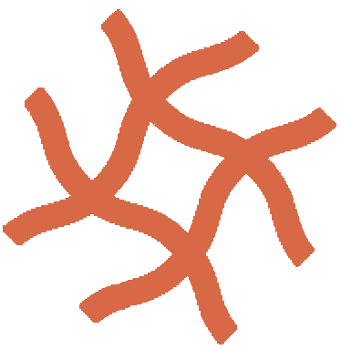
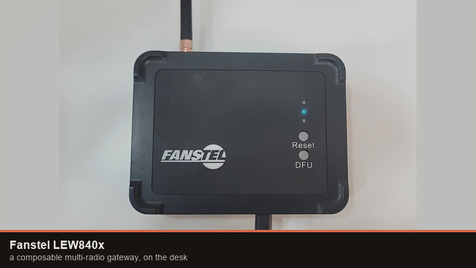
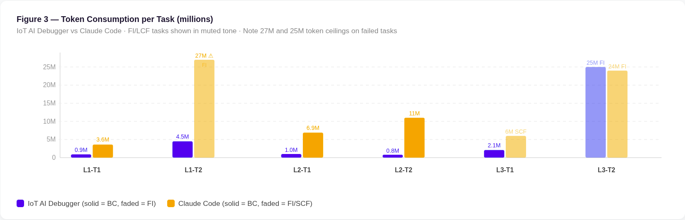
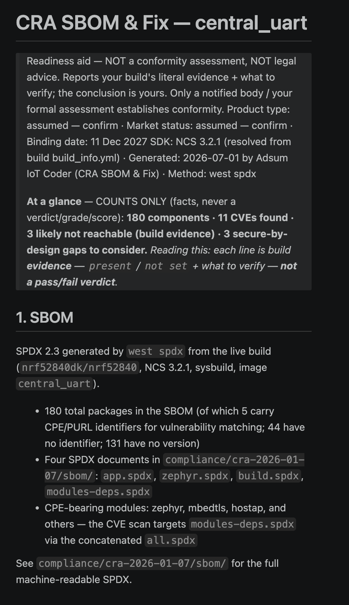
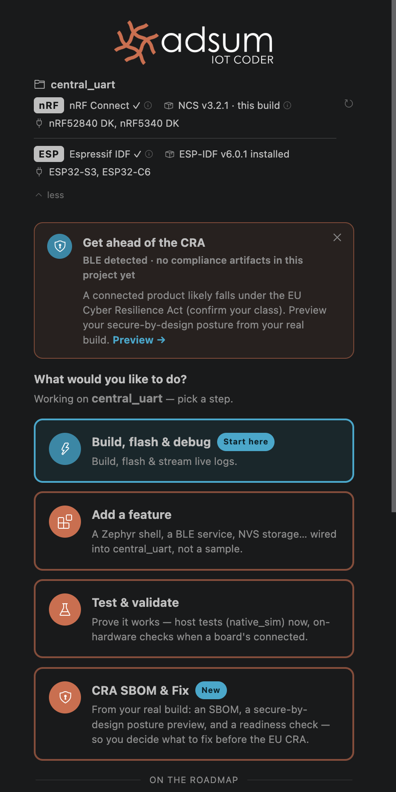
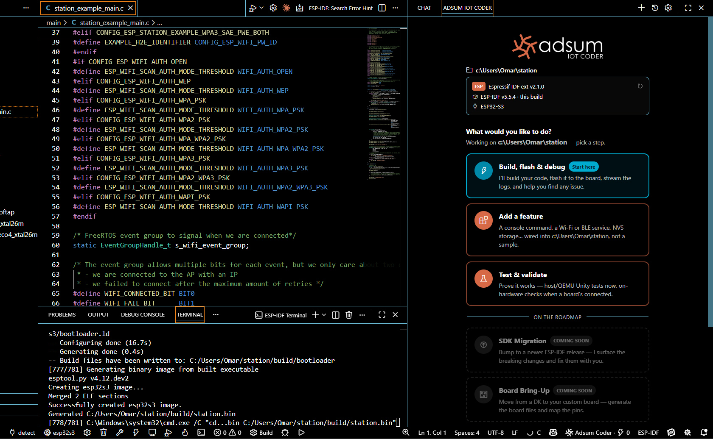

# Adsum IoT Coder

### ESP &amp; nRF · IoT Firmware Debug, Dev &amp; CRA Readiness

**An IoT coding agent for VS Code that works your whole firmware dev loop on Espressif ESP and Nordic nRF: scaffold, build, flash, test, observe, fix. It automates the routine firmware work you would rather not do, and cracks the runtime bugs general agents cannot, because it reads your board, not just your code.**

**What makes it different is real human expertise, not just the AI model.** Adsum is augmented with curated firmware knowledge authored by engineers who have shipped, loaded on demand and validated by an [open benchmark](#benchmark) on real hardware. Human-curated, not AI-generated.

**Shipping today:** Espressif ESP32 (incl. S3, C6) on ESP-IDF · Nordic nRF52 / nRF53 / nRF54 on nRF Connect SDK (Zephyr) · BLE (Bluetooth Low Energy) and Wi-Fi · **one-click EU Cyber Resilience Act (CRA) readiness: an SBOM plus a secure-by-design posture check.** Open source under Apache 2.0.

  
  
  
  
  

**[Install →](#getting-started)** · **[Docs →](https://docs.adsumnetworks.com)** · **[CRA readiness →](#cra-readiness-sbom-cve-and-secure-by-design)** · **[Benchmark →](#benchmark)** · **[Contribute →](#contributing)**

**[▶ Watch an industrial dual-chip gateway (BLE + Wi-Fi) built, debugged, and CRA-checked in under 30 minutes →](https://www.youtube.com/playlist?list=PLYh65pF22Elk)** · **[Read the walkthrough →](https://docs.adsumnetworks.com/ble-wifi-gateway)**

**No key, no account, no card.** The free tier is on by default: install and see it work on a real bug in your first minute.

---

> **On our open benchmark, running the identical model as Claude Code (Claude Haiku 4.5), Adsum fixed 4× more firmware bugs on the first device flash, at 3.8× fewer tokens on average and up to 13× on individual tasks. Anyone can rerun it.**

## What's New `v0.2.1`

 &nbsp;**Project memory.** Each project gets an `.adsum/` folder holding the board, the transport, the goal, and open defects. A new chat starts with that context instead of asking again. Multi-app repositories get one memory per app plus a shared one.

 &nbsp;**Long sessions.** Fixed three context-window accounting bugs, including the cause of `Prompt exceeds max length`. Compaction now tells you before it runs and keeps the goal, the board, the current bug, and the open file.

 &nbsp;**Log search.** RTT, UART, HCI, and sniffer captures are searched by pattern and read by line range instead of loaded whole. A real capture that cost 333,000 tokens now costs a few thousand.

 &nbsp;**Deeper nRF54 support.** Board knowledge for the nRF54L15 DK, the nRF54LM20 DK, and the nRF54LM20A, plus a migration guide from nRF52840 to nRF54L. The board is identified from connected hardware before the first build, and you are warned when a board needs a newer nRF Connect SDK than you have.

 &nbsp;**DeepSeek, natively.** Previously available only through a generic BYOK endpoint; now a provider in Settings with correct context length and pricing, and an extended-thinking dial from off to Max. Field-tested on our own gateway builds: the budget tiers handle most routine tasks with thinking kept on, and the full models can switch it off, which is where the token saving lives. [Exact models and settings](https://docs.adsumnetworks.com/models).

**Recently, in `v0.2.0`:** a complete two-chip industrial gateway, an nRF52840 BLE scanner and an ESP32 Wi-Fi/MQTT uplink, built, debugged, and CRA-checked from one spec **in under 30 minutes**, plus the curated model picker and credited expertise. **[Watch the playlist](https://www.youtube.com/playlist?list=PLYh65pF22Elk)** · **[read the walkthrough](https://docs.adsumnetworks.com/ble-wifi-gateway)**

**And in `v0.1.7`, the flagship:** one-click CRA readiness, an SBOM (SPDX), a secure-by-design posture check, and a CVE fix loop, covered in full [below](#cra-readiness-sbom-cve-and-secure-by-design). *Full history in the [changelog](./CHANGELOG.md).*

## CRA Readiness: SBOM, CVE, and secure-by-design

One click runs a build-time readiness check for the **EU Cyber Resilience Act (CRA)**, on both nRF and ESP. A readiness snapshot to help you prepare, **not a conformity assessment and not legal advice.**

**[▶ Watch the CRA check run on a real gateway build →](https://www.youtube.com/watch?v=uwl76c6FuY0)**

- **SBOM from your real build.** A machine-readable software bill of materials (SPDX), the CRA's named artifact, generated from your actual build with the vendor-native tools.
- **Known-CVE scan across your SBOM.** Matches your build's identifiable components (CPE/PURL) against public advisory databases (the EU's EUVD, NVD, and OSV) and lists what's found, with coverage stated honestly. Never a pass/fail verdict.
- **Secure-by-design posture** against your build's actual configuration: secure boot, signed updates, debug-port lock, secure pairing, secure storage and more, each with the plain-English requirement and the fix, ranked so you tackle the biggest gap first.
- **Bring a CVE, and close it.** Hand it a CVE from a vendor advisory: it confirms the affected component is really in your build (a literal SBOM lookup), links the advisory, then helps you bump the version, rebuild, and regenerate the SBOM.
- **Fix in the loop, not just flag.** It helps you wire the top fix (a secure bootloader, for example), rebuild, and re-verify, without leaving the agent.
- **Version advisories** for your detected SDK (links to review, never an automatic verdict).

It tells you which CRA date applies to you and writes a `compliance/` folder (report + machine-readable JSON + SBOM). Run it on your firmware, or try it on a bundled sample with nothing open.

  

## Why it exists

Adsum does not replace the embedded engineer, it accelerates them. Embedded firmware work is two jobs at once: a lot of routine, repetitive setup, and a handful of genuinely hard problems. General coding agents help with neither well, because both live outside the source file.

**The routine you would rather automate:** scaffolding a project, wiring devicetree and Kconfig, generating logging, adding a BLE service or a sensor, writing tests, bringing up a new board. Adsum does this work for you, idiomatically, on both ESP and nRF.

**The hard bugs you cannot grep:** a missing `settings_load()` after `bt_enable()` that silently breaks notifications after a reconnect; an ESP-IDF partition mismatch that only fails at runtime; a fault visible only by correlating logs across two boards. Adsum reads the device, captures the live logs, and works them the way a senior engineer does.

And the reason it is good at the hard parts is the part general agents do not have: **real human expertise.** The firmware knowledge that drives it is authored by engineers who have shipped, loaded on demand, and validated against an open benchmark. Human-curated, not AI-generated. And you can see whose: the first time the agent uses a piece of curated knowledge, it credits the engineer who wrote it, by name and linked, so the expertise is attributable, never anonymous.

It is also the direction frontier research points to: equip a general model with curated domain expertise that loads only when needed, rather than scale the model alone. The same approach appears in academic work on expert-skill-augmented models that shaped our benchmark ([arXiv:2603.19583](https://arxiv.org/abs/2603.19583)) and in industry practice ([context engineering](https://www.anthropic.com/engineering/effective-context-engineering-for-ai-agents), [Agent Skills](https://www.anthropic.com/engineering/equipping-agents-for-the-real-world-with-agent-skills)).

## What it does: debug, build, and prototype ESP and nRF firmware

- **Automatic platform detection.** nRF, ESP, both, or a fresh start, with the right tools for each.
- **Carry a full product build.** From one spec to a working two-chip BLE-to-WiFi industrial gateway (nRF52840 + ESP32), across both toolchains, built, debugged, and CRA-checked in under 30 minutes, with you approving each step. [Watch the playlist](https://www.youtube.com/playlist?list=PLYh65pF22Elk) · [walkthrough](https://docs.adsumnetworks.com/ble-wifi-gateway).
- **Build, flash & debug.** The full loop on real hardware: build, flash, capture live logs (RTT/UART on nRF, serial monitor on ESP), analyze, fix, repeat.
- **Capture & analyze device logs.** Correlated with your source, across one board or two.
- **Debug across all three layers.** The agent correlates the app log, the HCI bus, and the over-the-air radio, so you see where a BLE flow actually breaks, not just what the app logged. A guided sample run makes it easy to try, no hardware required.
- **Start a prototype, add a feature.** Scaffold a new nRF or ESP-IDF project; wire a BLE service, sensor, shell, or storage into your real project.
- **Test & validate.** Host tests and on-hardware checks.
- **Hand a session to your own agent (beta).** Export a session as one redacted file, or hand a running task to your own coding agent: Adsum brings the embedded expertise and drives the toolchain while your agent does the work.
- **Check CRA readiness.** One click: an SBOM (SPDX) plus a secure-by-design posture snapshot from your real build, on nRF and ESP. See [CRA Readiness](#cra-readiness-sbom-cve-and-secure-by-design).

  

  

## Supported platforms: ESP32 / ESP-IDF and nRF / nRF Connect SDK

| Platform | Chips (today) | SDK | Protocols (today) |
|:---|:---|:---|:---|
| **Nordic** | nRF52, nRF53, nRF54 (L15, LM20) | nRF Connect SDK (Zephyr) | BLE |
| **Espressif** | ESP32, ESP32-S3, ESP32-C6 | ESP-IDF | Wi-Fi, BLE |
| **Roadmap** | nRF7x (Wi-Fi), nRF9x (LTE-M, NB-IoT), on-device AI on nRF54 / ESP32, Linux devices (NVIDIA Jetson, Raspberry Pi) | | DECT NR+, NTN, 5G / 5G RedCap via hats |

CRA readiness (SBOM + secure-by-design posture) runs on both Nordic and Espressif builds.

## Benchmark

> **On our open benchmark, running the identical model as Claude Code (Claude Haiku 4.5), Adsum fixed 4× more firmware bugs on the first device flash, at 3.8× fewer tokens on average and up to 13× on individual tasks. Anyone can rerun it.**

Both agents ran the same model on real nRF52 hardware, so the gap measures architecture, not model power. Adsum IoT Coder closed 5 of 6 bugs versus Claude Code's 3, using 3.8× fewer tokens on average and as much as 13× fewer on the hardest individual tasks. The benchmark, IoT-FirmwareDebugBench v0.1, is open source. Run it yourself.

| Metric | Adsum IoT Coder | Claude Code |
|:---|:---|:---|
| Bugs closed (within 7 flashes) | **5 / 6** | 3 / 6 |
| Resolved on the first flash | **4 / 6** | 1 / 6 |
| Cross-device tasks (L3) | **1 / 2** | 0 / 2 |
| Tokens per resolved task | **1.86M** | 7.15M |

Full methodology, per-task results, and honest limitations are in the [benchmark report](./docs/benchmarks/v0.1-report.md). Methodology adapted from [arXiv:2603.19583](https://arxiv.org/abs/2603.19583).

## Getting Started

Search **Adsum IoT Coder** in the VS Code Extensions panel, or install from the [VS Code Marketplace](https://marketplace.visualstudio.com/items?itemName=AdsumNetwork.nrf-ai-debugger) or [Open VSX](https://open-vsx.org/extension/AdsumNetwork/nrf-ai-debugger) (for Cursor, Windsurf, and VSCodium) directly. No key, no account: the free tier is on by default.

**Prerequisites:** the [nRF Connect Extension Pack](https://marketplace.visualstudio.com/items?itemName=nordic-semiconductor.nrf-connect-extension-pack) for nRF work, or an ESP-IDF installation for ESP. The nRF54LM20 boards need nRF Connect SDK 3.3.0 or newer. Full requirements are in the [docs](https://docs.adsumnetworks.com/getting-started).

1. Start with a **sample run**, no board needed: the 30-second BLE debug demo, or the CRA readiness check on a bundled sample.
2. Open your **nRF or ESP project**; the home reads it and detects your boards and toolchain.
3. Pick one of the proposed **workflow cards**: *Build/flash & debug*, *Add a feature*, *Test & validate*, or *CRA SBOM & Fix*. For example: capture and analyze live logs from your board, add a BLE service to your project, or generate an SBOM from your real build.
4. Bring your own model whenever you want; the running task continues, no restart.

## Free tier: put it to work in your first minute, on us

Most tools make you choose a provider, paste an API key, and add a card before you can find out whether they help. We cut all of that.

Install Adsum IoT Coder and it just works. No key, no account, no card. The inference is on us, on a managed model, so you can point the agent at your own firmware in the first minute, not the first hour. It is a real working tier, generous enough to scaffold a project and run a full debug loop, not a locked demo.

When you want your own model or heavier usage, drop in a key for the GLM Coding Plan, Claude, DeepSeek, or any OpenAI- or Anthropic-compatible endpoint (cloud or a local model with strong tool-calling) and the switch is instant: the task you are in keeps running, no restart. The free tier is token-metered, and when you reach the limit a one-click prompt moves you onto your own key and the same task picks up exactly where it left off.

|  | Free tier | Bring your own key |
|:---|:---|:---|
| **API key** | Not required | Required |
| **Cost to you** | Nothing, the inference is on us | Your provider's rates |
| **Model** | Managed by Adsum | GLM, Claude, DeepSeek, or any compatible model |
| **Best for** | First run, evaluation, quick fixes | Daily driver, long sessions, model choice |

Adsum ships a curated picker: the **GLM Coding Plan**, **Claude**, **DeepSeek**, and any **OpenAI or Anthropic-compatible** endpoint, cloud or local. Recommended: **Claude Sonnet** for the strongest results, **Claude Haiku** (the benchmark model) for speed, the **GLM Coding Plan** or **DeepSeek** for cost-effective long sessions, or a **local model** to keep everything on your machine. Full setup and tested models in the [docs](https://docs.adsumnetworks.com/models).

## Roadmap

**Next:** full nRF9x and nRF7x support: cellular (LTE-M, NB-IoT), DECT NR+, and non-terrestrial networks (NTN). Deeper integration of the on-device AI features of nRF54 and ESP32, so edge inference gets the same build, flash, observe, and fix loop as the rest of your firmware. Linux-based devices, including NVIDIA Jetson and Raspberry Pi, with cellular hats (5G, 5G RedCap, NTN) alongside nRF and ESP radios. Modular, composable IoT gateways as first-class targets. And Adsum working inside your own coding agent, so you stay in the agent you prefer. The roadmap is shaped by what the community asks for and contributes.

## Contributing

That result comes from the expertise the agent runs on, not the model: curated firmware knowledge authored by practicing engineers and validated on real hardware. The agent gets stronger as that knowledge base grows, and there are two ways to get involved, both open to you — in short here, in full on the **[Contributing page](https://docs.adsumnetworks.com/contributing)**.

**Contribute knowledge (embedded experts and specialists).** This is the part that makes the agent good, and it is written by engineers, not the model: the hard-won fixes and idioms you only get from shipping nRF and ESP firmware. We are building a dedicated studio for authoring this expertise and will open it to outside specialists once it has earned its keep in-house. If you have lived inside these failure modes and want to shape it as a founding contributor, get credited for your work, and keep the rights to it, [start a discussion](https://github.com/adsumnetworks/Adsum-IoT-Coder/discussions).

**Contribute code (open-source developers).** The extension is open source (Apache-2.0, built on [Cline](https://github.com/cline/cline)) — the build, flash, and log-capture paths, the editor integration, and the platform support are all fair game. [Open an issue or PR](https://github.com/adsumnetworks/Adsum-IoT-Coder/issues).

## Limitations

We publish what is true today. **Adsum is an AI-based coding agent and can make mistakes.** The CRA workflow is a readiness aid, not a conformity assessment and not legal advice; only a notified body or your formal assessment establishes conformity. The CRA check scans your SBOM's identifiable components against public advisory databases and reports known CVEs with coverage stated; **coverage is limited to components carrying identifiers (CPE/PURL), and it does not find undisclosed or zero-day vulnerabilities.** You can also hand it a specific CVE to confirm against your build and patch. The benchmark is six BLE tasks on a single NCS version: a proof of concept, not statistical significance, and an ESP benchmark suite is on the roadmap (v0.2). nRF, nRF Connect SDK, and Nordic Semiconductor are trademarks of Nordic Semiconductor ASA; ESP32 and ESP-IDF are trademarks of Espressif Systems; Zephyr is a trademark of the Linux Foundation; Visual Studio Code is a trademark of Microsoft. This is an independent project, not affiliated with or endorsed by any of them.

## Privacy & Security

The runtime runs entirely on your machine, and so is your project memory: the `.adsum/` folder lives in your repo and is never uploaded. Only the log snippets and code context a task needs go to the AI provider you configure. BYOK: you control which model and endpoint you trust. Pseudonymous product analytics only (installs, activations, feature usage, errors), keyed to a random install ID; never your source code, chat content, or device logs. Opt out anytime with `telemetry.telemetryLevel: off`. Source is fully open and auditable.

## About

**[Adsum Networks](https://github.com/adsumnetworks)** has built embedded firmware on Nordic nRF and other SoC platforms for 8 years, living inside the failure modes that cost embedded engineers their days. We built Adsum IoT Coder because general coding agents leave embedded developers without reliable help for the work that fills the day: the routine setup worth automating, and the runtime bugs that never show up in source review. The difference is real human expertise, not just the AI model: curated firmware knowledge authored by engineers who have shipped, loaded on demand and measured against an open benchmark on real hardware, so the value can be defended, not just claimed.

---

**Install from the [VS Code Marketplace](https://marketplace.visualstudio.com/items?itemName=AdsumNetwork.nrf-ai-debugger) or [Open VSX](https://open-vsx.org/extension/AdsumNetwork/nrf-ai-debugger) and see it work in your first minute. No key, no account.**

**[adsumnetworks.com](https://adsumnetworks.com)** · **[GitHub](https://github.com/adsumnetworks/Adsum-IoT-Coder)** · **[Discussions](https://github.com/adsumnetworks/Adsum-IoT-Coder/discussions)** · **[YouTube](https://www.youtube.com/@adsumnetworks)**

**Open-core:** extension code Apache-2.0 © 2026 Adsum Networks (a derivative of [Cline](https://github.com/cline/cline); see [NOTICE](NOTICE)) · bundled knowledge content CC-BY-SA-4.0 (see [iot-knowledge/LICENSE](iot-knowledge/LICENSE)) · downloaded registry bits are proprietary.

