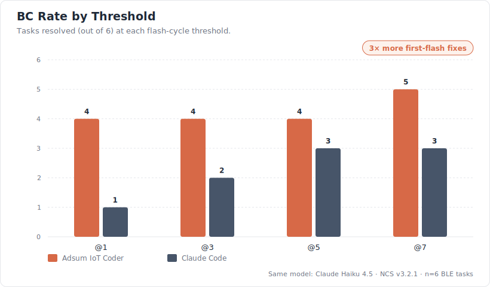
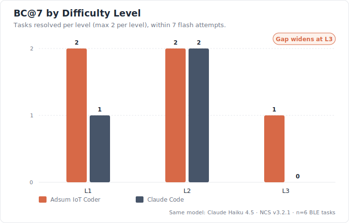
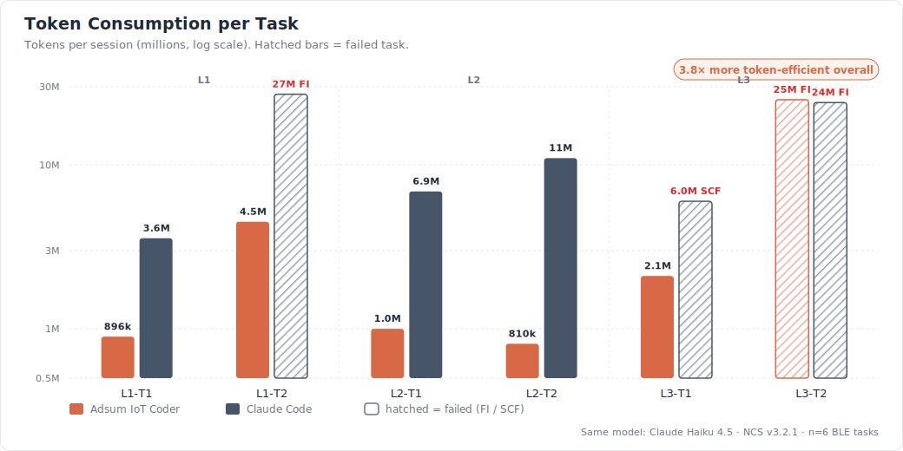
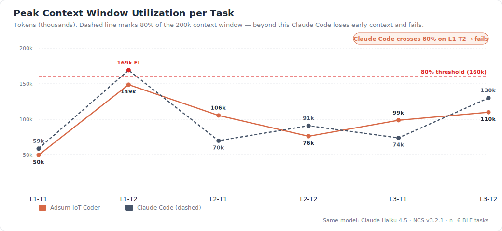

# IoT-FirmwareDebugBench v0.1

## Benchmarking AI Agents for IoT Firmware Debugging

**Authors:** Adsum Networks  
**Date:** May 2026  
**Version:** 0.1 — Initial Release  
**Repository:** [github.com/adsumnetworks/Adsum-IoT-Coder](https://github.com/adsumnetworks/Adsum-IoT-Coder)

---

## Contents

1. [Abstract](#abstract)
2. [Introduction](#1-introduction)
3. [Experimental Setup](#2-experimental-setup)
4. [Benchmark Design](#3-benchmark-design)
5. [Results](#4-results)
6. [Discussion](#5-discussion)
7. [Limitations](#6-limitations)
8. [Conclusion](#7-conclusion)
9. [Appendices](#appendix-a--token-calculation-script)

---

## Abstract

General-purpose coding agents—designed for software development—face significant challenges when applied to embedded firmware debugging. Unlike software tasks, firmware debugging requires hardware-in-the-loop (HIL) log capture, domain-specific knowledge of BLE protocol stacks, toolchain environment management, and runtime-only failure modes that are invisible from source code alone. This report introduces **IoT-FirmwareDebugBench**, a reproducible benchmark evaluating AI agents on real nRF52 hardware across six BLE firmware debugging tasks of increasing difficulty. We compare the **Adsum IoT Coder**—a specialized VSCode extension built on Claude Haiku 4.5—against **Claude Code** running the same underlying model without embedded domain context. Results show that the specialized agent achieves **5/6 tasks resolved** versus **3/6 for Claude Code**, while consuming **3.8× fewer tokens per resolved task on average (up to 13× on individual tasks)** and avoiding context-overflow failures on long debug loops.

> **At a glance:** 5/6 vs 3/6 resolved · 3.8× more token-efficient · 0 context-overflow failures · same model (Claude Haiku 4.5)

---

## 1. Introduction

Embedded firmware debugging is among the most difficult tasks in software engineering. Root causes are often invisible in source code and only manifest at runtime through live device logs, BLE protocol behavior, or hardware-specific configuration interactions. Developers working with Nordic Semiconductor's nRF Connect SDK (NCS) and Zephyr RTOS routinely spend hours diagnosing issues that require understanding BLE stack internals, Kconfig dependency chains, and multi-device timing relationships.

General-purpose coding agents such as Claude Code and GitHub Copilot were not designed for this domain. They lack NCS-specific API knowledge, cannot natively capture hardware logs, and frequently hallucinate functions or configuration options from other SDK ecosystems (ESP-IDF, SoftDevice, FreeRTOS). The Adsum IoT Coder addresses this by embedding domain knowledge directly into the agent's context through structured skill files and an opinionated debug workflow.

This benchmark provides the first systematic evaluation of AI agents on real embedded firmware debugging tasks.

---

## 2. Experimental Setup

### 2.1 Hardware

| Board       | Role                 | Tasks                                    |
| ----------- | -------------------- | ---------------------------------------- |
| nRF52840 DK | Peripheral / Central | L1-T1, L1-T2, L2-T1, L2-T2, L3-T1, L3-T2 |
| nRF52832 DK | Peripheral           | L3-T1, L3-T2                             |

> L3-T1 and L3-T2 are multi-device tasks; both boards run simultaneously.

All firmware built with **nRF Connect SDK v3.2.1** / Zephyr 4.2.99. Log output captured via RTT or UART at 115200 baud (default NCS settings).

### 2.2 Agents Under Evaluation

| Agent               | LLM                           | Interface                   | Domain Context                               |
| ------------------- | ----------------------------- | --------------------------- | -------------------------------------------- |
| **Adsum IoT Coder** | Claude Haiku 4.5 (openrouter) | VSCode Extension (custom)   | NCS skill library, structured debug workflow |
| **Claude Code**     | Claude Haiku 4.5              | VSCode Extension (official) | Workspace files only                         |

**Note:** reasoning/thinking mode was disabled and prompt caching was enabled for both agents to maintain consistent inference settings.

Both agents use the same underlying model to isolate the contribution of domain architecture from raw model capability.

### 2.3 Prompt

Generic agents received the following standardized prompt for all tasks:

```
I'm debugging a Nordic nRF52840 firmware project built with nRF Connect SDK
(NCS) / Zephyr RTOS. The board is connected via USB (J-Link).

The device(s) are already flashed with the current firmware. Something is wrong
with the BLE behavior. Help me through the full debug cycle:

1. Capture live UART/RTT logs from the connected device(s)
2. Analyze the logs to find the root cause
3. Fix the code
4. Build and flash the updated firmware
5. Capture fresh logs to confirm the fix
6. Give me a summary of what was wrong and what you changed

The NCS toolchain is installed. Use west for build and flash. Check prj.conf
for the log backend (UART at 115200 baud or RTT using the appropriate tool).
Do not suggest commands for me to run. Execute every step using the terminal.

Observed behavior: [TASK-SPECIFIC SYMPTOM]
```

The Adsum IoT Coder required no prompt — the evaluator selects **"Analyze device logs"** from the extension interface.

### 2.4 Token Measurement

- **Adsum IoT Coder:** token usage reported through the built-in usage panel (input + output tokens, with prompt caching enabled)
- **Claude Code:** computed from session JSONL files using a provided Python script ([`claud-code-tokens-count.py`](./claud-code-tokens-count.py)), summing `input_tokens + cache_creation_input_tokens + cache_read_input_tokens + output_tokens`

---

## 3. Benchmark Design

### 3.1 Metrics

| Metric   | Description                                                                                                                      |
| -------- | -------------------------------------------------------------------------------------------------------------------------------- |
| **BC@k** | Bug fixed within k `west flash` executions. k increments only on successful flash, not on failed builds or log capture attempts. |
| **TOK**  | Total tokens consumed across the full session (input + output + cache).                                                          |
| **CTX**  | Peak context window utilization in a single request (tokens). Model maximum: 200,000 tokens.                                     |

### 3.2 Outcome Codes

| Code    | Meaning                                                                          |
| ------- | -------------------------------------------------------------------------------- |
| **BC**  | Behavior Correct — bug fixed and device behavior confirmed                       |
| **FI**  | Fix Incomplete — device flashed but bug persists after k attempts                |
| **LCF** | Log Capture Failure — agent could not obtain usable device logs                  |
| **SCF** | Static Code Fix — agent skipped log capture and diagnosed from source code alone |
| **CF**  | Compile Failure — fix attempted but build failed                                 |
| **AF**  | Analysis Failure — logs captured but diagnosis incorrect                         |

> **Notation:** In the per-flash tables below, `X→Y` denotes the agent's initial attempt outcome (`X`) followed by the outcome reached by the table's flash threshold (`Y`). For example, `LCF→FI` means the first attempt resulted in Log Capture Failure; by the table threshold the agent had moved to Fix Incomplete.

> **Note on SCF:** An agent that fixes a bug without capturing logs may succeed on simple tasks through pattern recognition but cannot diagnose runtime-only failures at L2 and L3. SCF is recorded as a failure for methodology compliance — the agent did not execute the methodology under test (HIL log capture + hardware-grounded diagnosis), so the result does not generalize to runtime-only or cross-device bugs.

### 3.3 Task Suite

Tasks are derived from NCS sample applications with controlled bug modifications. All bugs were validated to be reproducible before agent evaluation.

| Task      | Level | Base Sample                        | Board(s)            | Bug Description                                                                                                                                               |
| --------- | ----- | ---------------------------------- | ------------------- | ------------------------------------------------------------------------------------------------------------------------------------------------------------- |
| **L1-T1** | L1    | `peripheral_lbs`                   | nRF52840            | Advertising restart moved from `k_work` handler into `disconnected()` callback directly, causing `BT_HCI_ERR_CMD_DISALLOWED` on reconnect attempt             |
| **L1-T2** | L1    | `peripheral_uart`                  | nRF52840            | `CONFIG_LOG_BUFFER_SIZE=256` with verbose BT log levels enabled, causing buffer overflow and systematic log loss during BLE initialization                    |
| **L2-T1** | L2    | `peripheral_uart`                  | nRF52840            | `BT_LE_ADV_OPT_FILTER_CONN` enabled with accept list populated from bonds only — device invisible to unpaired centrals with no error in log                   |
| **L2-T2** | L2    | `peripheral_uart` (bonding)        | nRF52840            | `settings_load()` removed from `main.c` — bonds stored but never loaded, causing GATT notification failure (`-5 ENOENT`) after reconnect                      |
| **L3-T1** | L3    | `peripheral_uart` + `central_uart` | nRF52840 + nRF52832 | NUS subscription removed from `discovery_complete()` on central, data flows only in one direction                                                             |
| **L3-T2** | L3    | `central_hids` + `peripheral_hids` | nRF52840 + nRF52832 | Mismatched security levels: central requests `BT_SECURITY_L3` (MITM), peripheral offers `BT_SECURITY_L1` — pairing fails with error 2, HID reports never sent |

**Symptom prompts used:**

| Task  | Observed behavior given to agent                                                                       |
| ----- | ------------------------------------------------------------------------------------------------------ |
| L1-T1 | "After I disconnect from the device on my phone, I noticed an error in the logs"                       |
| L1-T2 | "I'm seeing 'log messages dropped' warnings during BLE initialization and some early logs are missing" |
| L2-T1 | "The device appears in my phone scanner but it can't connect"                                          |
| L2-T2 | "The device didn't appear in nRF Connect mobile app"                                                   |
| L3-T1 | "The two devices connected but data is only received from one side"                                    |
| L3-T2 | "Central connects successfully but HID data is not sent/received"                                      |

---

## 4. Results

### 4.1 Outcome Tables

**Table 1 — BC@1** _(fixed on first flash)_

| Agent           | L1-T1                 | L1-T2  | L2-T1                  | L2-T2                 | L3-T1                 | L3-T2 |
| --------------- | --------------------- | ------ | ---------------------- | --------------------- | --------------------- | ----- |
| Adsum IoT Coder | BC / 896k / CTX 49.9k | FI     | BC / 1.0M / CTX 105.5k | BC / 810k / CTX 76.3k | BC / 2.1M / CTX 98.7k | LCF   |
| Claude Code     | BC / 3.57M / CTX 59k  | LCF→FI | SCF                    | LCF→FI                | SCF / 6.0M / CTX 74k  | FI    |

**Table 2 — BC@3** _(fixed within 3 flashes)_

| Agent           | L1-T1                 | L1-T2  | L2-T1                  | L2-T2                 | L3-T1                 | L3-T2 |
| --------------- | --------------------- | ------ | ---------------------- | --------------------- | --------------------- | ----- |
| Adsum IoT Coder | BC / 896k / CTX 49.9k | FI     | BC / 1.0M / CTX 105.5k | BC / 810k / CTX 76.3k | BC / 2.1M / CTX 98.7k | FI    |
| Claude Code     | BC / 3.57M / CTX 59k  | LCF→FI | BC / 6.89M / CTX 70k   | LCF→FI                | SCF / 6.0M / CTX 74k  | FI    |

**Table 3 — BC@5** _(fixed within 5 flashes)_

| Agent           | L1-T1                 | L1-T2  | L2-T1                  | L2-T2                 | L3-T1                 | L3-T2 |
| --------------- | --------------------- | ------ | ---------------------- | --------------------- | --------------------- | ----- |
| Adsum IoT Coder | BC / 896k / CTX 49.9k | FI     | BC / 1.0M / CTX 105.5k | BC / 810k / CTX 76.3k | BC / 2.1M / CTX 98.7k | FI    |
| Claude Code     | BC / 3.57M / CTX 59k  | LCF→FI | BC / 6.89M / CTX 70k   | BC / 11M / CTX 91k    | SCF / 6.0M / CTX 74k  | FI    |

**Table 4 — BC@7** _(fixed within 7 flashes )_

| Agent           | L1-T1                 | L1-T2                  | L2-T1                  | L2-T2                 | L3-T1                 | L3-T2               |
| --------------- | --------------------- | ---------------------- | ---------------------- | --------------------- | --------------------- | ------------------- |
| Adsum IoT Coder | BC / 896k / CTX 49.9k | BC / 4.5M / CTX 148.7k | BC / 1.0M / CTX 105.5k | BC / 810k / CTX 76.3k | BC / 2.1M / CTX 98.7k | FI / 25M / CTX 110k |
| Claude Code     | BC / 3.57M / CTX 59k  | FI / 27M / CTX 169k    | BC / 6.89M / CTX 70k   | BC / 11M / CTX 91k    | SCF / 6.0M / CTX 74k  | FI / 24M / CTX 130k |

---

### 4.2 Summary

| Agent           | BC@1    | BC@3    | BC@5    | BC@7    | Total TOK | TOK/BC@7  |
| --------------- | ------- | ------- | ------- | ------- | --------- | --------- |
| Adsum IoT Coder | **4/6** | **4/6** | **4/6** | **5/6** | 34.3M     | **1.86M** |
| Claude Code     | 1/6     | 2/6     | 3/6     | 3/6     | 78.5M     | 7.15M     |

> **TOK/BC** = total session tokens ÷ number of tasks resolved. Measures true cost efficiency including failed sessions.

### 4.3 Per-Level Breakdown (BC@7)

| Agent           | L1 (max 2) | L2 (max 2) | L3 (max 2) |
| --------------- | ---------- | ---------- | ---------- |
| Adsum IoT Coder | **2/2**    | **2/2**    | **1/2**    |
| Claude Code     | 1/2        | 2/2        | 0/2        |

### 4.4 Charts









---

## 5. Discussion

### 5.1 Same Model, Different Results

Both agents run Claude Haiku 4.5. The performance gap is entirely attributable to context architecture, not model capability. The Adsum IoT Coder provides the model with structured NCS knowledge — BLE Kconfig dependency maps, API references, and a constrained debug workflow — that guides the model to reason correctly without exhausting its context window.

### 5.2 The SCF Pattern

Claude Code exhibited **Static Code Fix (SCF)** behavior on L2-T1 (first attempt) and L3-T1 (all attempts) — diagnosing from source code without capturing any device logs. On L2-T1, static analysis accidentally produced a correct fix on the second attempt. On L3-T1, the fix was behaviorally indeterminate because the root cause (bond asymmetry revealed only through cross-device log correlation) is invisible from source code alone. SCF is a methodology failure regardless of outcome: an agent that skips log capture cannot diagnose runtime-only or multi-device failures.

### 5.3 Context Overflow as a Failure Predictor

Claude Code consumed 27M tokens on L1-T2 (a Level 1 task) and still failed to resolve it, with peak CTX reaching 169k/200k (84.5%). At this utilization, the model begins losing early context — including the original symptom description and initial log analysis — leading to circular reasoning and repeated fix attempts. The Adsum IoT Coder's structured context management prevents this: the domain skill files provide dense, relevant context while suppressing irrelevant toolchain searching that inflates Claude Code's token consumption.

### 5.4 L3-T2: Unsolved by Both Agents

Neither agent resolved L3-T2 (HIDS security mismatch). This task requires correlating security negotiation events across two devices and understanding the interaction between `BT_SECURITY_L3` (MITM protection) and `BT_SECURITY_L1` (no security) at the SMP layer. The planned addition of a BLE sniffer tool to the Adsum IoT Coder is expected to address this class of task in a future release by providing PHY-layer visibility unavailable from UART logs alone.

### 5.5 Cost Efficiency

At BC@7, the Adsum IoT Coder resolved 5 tasks consuming a mean of 1.86M tokens per resolved task, versus Claude Code's 7.15M tokens per resolved task — a **3.8× efficiency advantage**.

---

## 6. Limitations

**Task count.** Six tasks is sufficient for a proof-of-concept evaluation. Statistical significance requires 20–30 tasks. This release establishes methodology; expanded task suites are planned.

**Single NCS version.** All tasks validated on NCS v3.2.1. Kconfig behavior and API availability differ across NCS versions.

**No GitHub Copilot results.** Copilot evaluation is planned for v0.2. Token visibility limitations on the free tier delayed this comparison.

**BLE sniffer absent.** L3-T2 and similar PHY-layer tasks cannot be fully diagnosed from UART logs alone. Sniffer integration is in development.

**Single evaluator.** All sessions were run and scored by one evaluator. Inter-rater reliability has not been established.

**Prompt asymmetry.** Both agents received task-equivalent entry points but not identical ones: Claude Code was given an explicit textual prompt; Adsum IoT Coder invoked its built-in "Analyze device logs" workflow. The workflow itself is part of the architecture under test — its absence in general-purpose agents is the contribution being measured — but readers should know the entry points are not identical.

---

## 7. Conclusion

IoT-FirmwareDebugBench demonstrates that domain-specialized agents outperform general-purpose agents on embedded firmware debugging tasks, even when both use the same underlying language model. The Adsum IoT Coder resolved 5 of 6 tasks (83%) versus 3 of 6 (50%) for Claude Code, with 3.8× better token efficiency and no context overflow failures. The performance gap widens with task difficulty: at L3 (multi-device tasks), the specialized agent resolved 1/2 while Claude Code resolved 0/2 and fell back to log-free static analysis.

These results motivate continued investment in domain-specific agent architectures for IoT and embedded systems — a field where general-purpose tools leave developers without reliable AI assistance precisely for the hardest debugging scenarios.

**What's next in v0.2.** Expanded task suite (20–30 tasks) for statistical significance; GitHub Copilot and OpenAI Codex comparisons; nRF53 and nRF54 board coverage; BLE sniffer (Wireshark / nRF Sniffer) integration to address PHY-layer tasks like L3-T2; older NCS LTS version coverage. Community-contributed tasks and replications are welcomed via the repository.

---

## Appendix A — Token Calculation Script

Token counts for Claude Code sessions were computed using [`claud-code-tokens-count.py`](./claud-code-tokens-count.py), included in this repository. The script parses session JSONL files and sums `input_tokens`, `cache_creation_input_tokens`, `cache_read_input_tokens`, and `output_tokens` across all messages, and reports peak context window utilization.

## Appendix B — Reproducibility

All bug modifications are described in Section 3.3. NCS sample applications are available at `nrfconnect/sdk-nrf` on GitHub, tag `v3.2.1`. Modified project files are available in the [benchmarks/v0.1/](https://github.com/adsumnetworks/Adsum-IoT-Coder/tree/main/benchmarks/v0.1) folder.

---

_IoT-FirmwareDebugBench v0.1 — Adsum Networks — May 2026_  
_github.com/adsumnetworks/Adsum-IoT-Coder · Apache 2.0_
