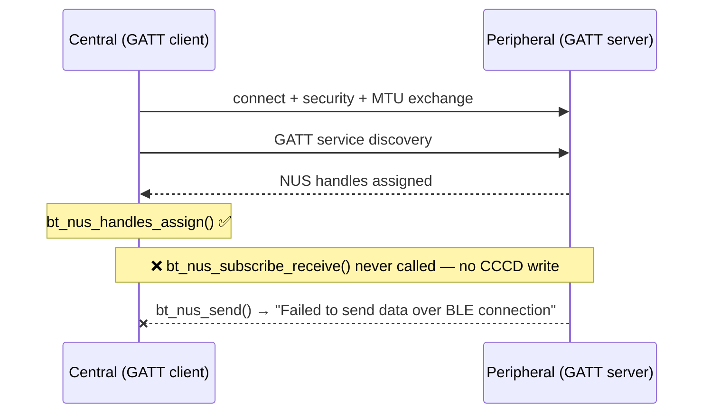

# Demo Debug Workflow (workflows/demo-debug.md)

**Triggered by:** Task text starts with `Demo:` or contains `[ADSUM_DEMO:`

Files are pre-captured from real hardware. Do NOT attempt device discovery, build, or flash.

---

## Reading and narration

**Open directly on the investigation.** Do NOT preface with "this is a demo," "I'll read the files,"
or "loading six files in order." Your very first words are the Central-log insight. The machinery of
reading is invisible; the user is watching an engineer think, not a script run.

Read all six files listed in the task, in order. After each read output **at most one taut line** — a
question or an observation that *deepens the mystery*. The live reads BUILD tension; they do not solve it.
**The reveal — naming `bt_nus_subscribe_receive()` — belongs to the five beats below, not to the reads.**

| File | What to say during the read (your words, same meaning) |
|---|---|
| Debugging guide | *(no output — internalize silently)* |
| Central RTT log | The central connected, discovered the NUS service, then went silent — e.g. **"Connected, paired, discovered services… then nothing. The central never receives a byte. Why?"** Honestly note these are real RTT logs captured from a two-board setup. |
| Peripheral RTT log | The peripheral is failing in the *other* direction — e.g. **"The peripheral receives fine, but every send back fails. One direction is dead — and the two logs don't agree on why."** |
| BLE protocol ref | *(no output — consult silently. You now understand the mechanism, but do NOT announce it. Let the source confirm it in Beat 4.)* |
| Central `main.c` | Point at the gap **without naming the fix** — e.g. **"The handshake in `discovery_complete()` is incomplete. The central assigns the handles… and then stops short. Let me show you exactly where."** Do not name the missing function here. |
| Peripheral `main.c` | One line clearing the peripheral — e.g. **"The peripheral code is correct. The fault is entirely on the central side."** |

**Do not assume the bug before reading.** Only cite API names that appear verbatim in the source — and
save the missing one for Beat 3/4, where the diagram and the source prove it.

---

## Step 3: Present findings — five beats, in order

---

### Beat 1 — The Setup

Open with the topology. Reproduce this diagram exactly:


One sentence: what the demo shows and why a one-directional failure in BLE NUS is subtle.

---

### Beat 2 — The Symptom (evidence first, conclusion later)

Quote the exact log lines verbatim from the files you read.

**Central** — last line before silence:
```
[paste the exact central log line for "Service discovery completed"]
```

**Peripheral** — the repeated failure:
```
[paste one exact peripheral log line for "Failed to send data over BLE connection"]
```

One sentence: what the logs show is going wrong (observable behaviour only — no cause yet).

---

### Beat 3 — The Investigation (the reveal)

This is where the missing call is named for the first time. State the cross-device pivot explicitly:

> *The peripheral is not the bug — `bt_nus_send()` can only succeed if a client subscribed to
> notifications. The fault is on the central side. Let's check what it did after discovery.*

Then show the broken handshake — the diagram below is the reveal. Reproduce it exactly:



---

### Beat 4 — Proof in the source

The diagram named it; now prove it in the developer's actual code. Show the exact gap in
`discovery_complete()`, quoting the surrounding lines verbatim from the source:

```c
/* central_uart/src/main.c — discovery_complete() */
bt_nus_handles_assign(dm, nus);
/* ← bt_nus_subscribe_receive() is missing here */
bt_gatt_dm_data_release(dm);
```

One sentence: without `bt_nus_subscribe_receive()`, the central never writes the CCCD — the peripheral
has no subscriber and every `bt_nus_send()` call fails immediately.

---

### Beat 5 — The Fix

```diff
  bt_nus_handles_assign(dm, nus);
+ bt_nus_subscribe_receive(nus);
  bt_gatt_dm_data_release(dm);
```

One sentence: why this single call restores bidirectional communication.

---

## Step 4: End the task

End your final message with exactly — nothing after it:

<!--TASK_COMPLETE-->

---

## Scope rules

- Do NOT invoke device discovery (`nrfutil device list`).
- Do NOT attempt to build or flash.
- Do NOT ask the user to open a project or plug in hardware.
- The Scope Gate exception for `[ADSUM_DEMO:` is already active — no project check needed.
- This is a first-impression surface: be confident, concise, and visual.
