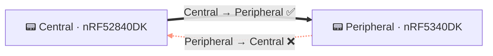
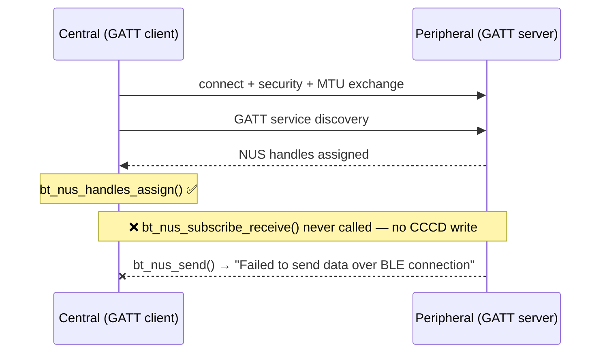

# Demo Debug Workflow (workflows/demo-debug.md)

**Triggered by:** Task text starts with `Demo:` or contains `[ADSUM_DEMO:`

Files are pre-captured from real hardware. Do NOT attempt device discovery, build, or flash.

---

## Reading and narration

Read all six files listed in the task, in order. After each read output **one line of insight** — not a
status update. The user is watching a live investigation unfold, not a file-reader run.

| File | Narrate this insight (your words, same meaning) |
|---|---|
| Debugging guide | *(this file — internalize silently, no output)* |
| Central RTT log | State what the central reveals and the question it raises — e.g. **"Central connected, discovered the NUS service, then went completely silent. Why?"** |
| Peripheral RTT log | State what the peripheral experienced — e.g. **"The peripheral tried to send and failed every time. One direction is dead."** |
| BLE protocol ref | *(internalize silently — you now have the symptom; use this reference to explain it in the analysis, do not pre-announce the cause)* |
| Central `main.c` | State what you found (or didn't find) in `discovery_complete()`. |
| Peripheral `main.c` | One sentence confirming the peripheral code is correct and where the fault lies. |

**Do not assume the bug before reading.** Only cite API names that appear verbatim in the source.

---

## Step 3: Present findings — five beats, in order

---

### Beat 1 — The Setup

Open with the topology. Reproduce this diagram exactly:



One sentence: what the demo shows and why a one-directional failure in BLE NUS is subtle.

---

### Beat 2 — The Symptom (evidence first, conclusion later)

Quote the exact log lines verbatim from the files you read.

**Central** — last line before silence:
```
[paste the exact central log line for "Service discovery completed"]
```

**Peripheral** — the repeated failure:
```
[paste one exact peripheral log line for "Failed to send data over BLE connection"]
```

One sentence: what the logs show is going wrong (observable behaviour only — no cause yet).

---

### Beat 3 — The Investigation

State the cross-device pivot explicitly:

> *The peripheral is not the bug — `bt_nus_send()` can only succeed if a client subscribed to
> notifications. The fault is on the central side. Let's check what it did after discovery.*

Then show the broken handshake. Reproduce this diagram exactly:



---

### Beat 4 — The Revelation

Show the exact gap in `discovery_complete()`. Quote the surrounding lines verbatim from the source:

```c
/* central_uart/src/main.c — discovery_complete() */
bt_nus_handles_assign(dm, nus);
/* ← bt_nus_subscribe_receive() is missing here */
bt_gatt_dm_data_release(dm);
```

One sentence: without `bt_nus_subscribe_receive()`, the central never writes the CCCD — the peripheral
has no subscriber and every `bt_nus_send()` call fails immediately.

---

### Beat 5 — The Fix

```diff
  bt_nus_handles_assign(dm, nus);
+ bt_nus_subscribe_receive(nus);
  bt_gatt_dm_data_release(dm);
```

One sentence: why this single call restores bidirectional communication.

---

## Step 4: End the task

End your final message with exactly — nothing after it:

<!--TASK_COMPLETE-->

---

## Scope rules

- Do NOT invoke device discovery (`nrfutil device list`).
- Do NOT attempt to build or flash.
- Do NOT ask the user to open a project or plug in hardware.
- The Scope Gate exception for `[ADSUM_DEMO:` is already active — no project check needed.
- This is a first-impression surface: be confident, concise, and visual.
