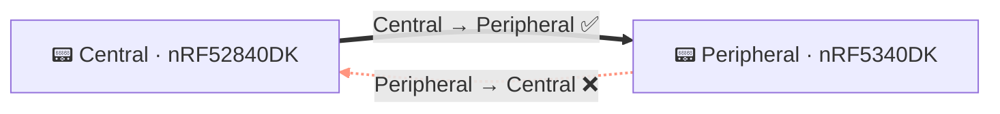
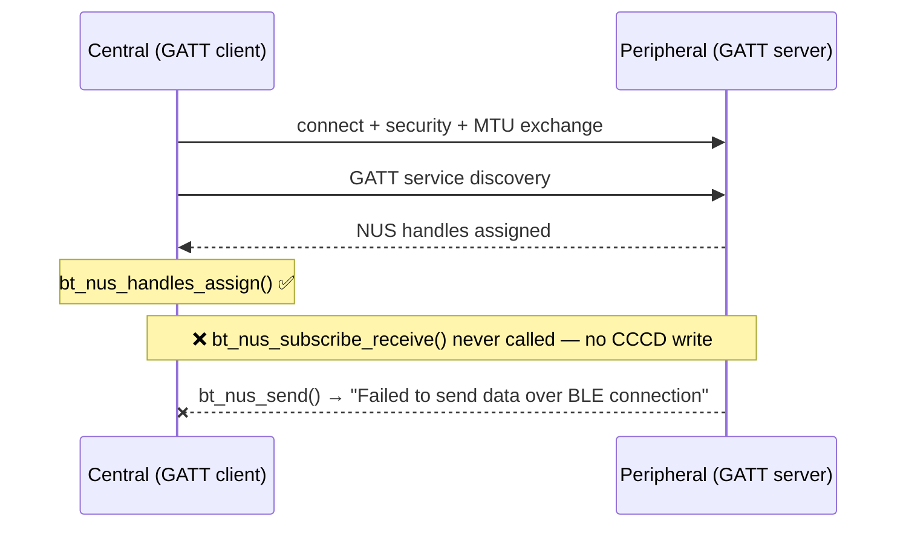

# Demo Debug Workflow (workflows/demo-debug.md)

**Triggered by:** Task text starts with `Demo:` or contains `[ADSUM_DEMO:`

Files are pre-captured from real hardware. Do NOT attempt device discovery, build, or flash.

---

## Reading and narration

**Open with a hook, then read.** Before the reads, write a short intro (2–3 sentences) *to the developer*:
frame the mission — a real, subtle one-directional BLE NUS bug captured from two physical Nordic boards —
name the evidence you're bringing in (the RTT logs from both boards, both firmware sources, the NUS
protocol reference), and invite them to follow you to the fix and the live compile proof at the end.
Describe the evidence you're gathering, **not the act of reading files**: say "let me pull the RTT logs
from both boards and both firmware sources," never "I'll read six files" or "I'll read silently." Keep it
credible for an embedded engineer — no hype. Name the evidence by **role only**; say nothing about what any
file *contains*. This intro is the only text before the reads.

**Keep every finding and reaction for the beats.** The six reads render to the user as a single collapsed
"read 6 files" step. A *finding* stated before that step appears *above* it and reads backwards, as if you
concluded before opening the files. The intro (framing) belongs before the reads; everything you *found*
(the silence, the failed sends, the topology, the cause) belongs to the beats. Your first output after the
reads is Beat 1.

**Never name `bt_nus_subscribe_receive()` (or "the fix") before Beat 3.** You already know the answer from
these instructions — the developer must still watch you derive it from the evidence across Beats 1–2 before
you name it in Beat 3. Only cite API names that appear verbatim in the source. Leading with the answer kills
the demo.

**Present the five beats immediately after the reads** — no "Ready to present?", no "Want to see the raw
logs?", no confirmation gate or button choices before the beats. The "read 6 files" step is the run-up;
Beat 1 follows it directly.

---

## Step 3: Present findings — five beats, in order

---

### Beat 1 — The Setup

Lead with the topology diagram, not prose — don't restate the intro's framing. This mermaid diagram is
**required** — render it, do not describe it in words:



One sentence: what the demo shows and why a one-directional failure in BLE NUS is subtle.

---

### Beat 2 — The Symptom (evidence first, conclusion later)

Quote the exact log lines verbatim from the files you read. Use plain code fences (no language tag) for
log lines — they are RTT output, not source code.

**Central** — last line before silence:
```
[paste the exact central log line for "Service discovery completed"]
```

**Peripheral** — the repeated failure:
```
[paste one exact peripheral log line for "Failed to send data over BLE connection"]
```

One sentence: what the logs show is going wrong (observable behaviour only — no cause yet).

---

### Beat 3 — The Investigation (the reveal)

This is where the missing call is named for the first time. State the cross-device pivot explicitly:

> *The peripheral is not the bug — `bt_nus_send()` can only succeed if a client subscribed to
> notifications. The fault is on the central side. Let's check what it did after discovery.*

Then show the broken handshake — this mermaid diagram is the reveal and is **required**; render it, do not describe it in prose:



---

### Beat 4 — Proof in the source

The diagram named it; now prove it in the developer's actual code. Show the exact gap in
`discovery_complete()`, quoting the surrounding lines verbatim from the source:

```c
/* central_uart/src/main.c — discovery_complete() */
bt_nus_handles_assign(dm, nus);
/* ← bt_nus_subscribe_receive() is missing here */
bt_gatt_dm_data_release(dm);
```

One sentence: without `bt_nus_subscribe_receive()`, the central never writes the CCCD — the peripheral
has no subscriber and every `bt_nus_send()` call fails immediately.

---

### Beat 5 — The Fix

```diff
  bt_nus_handles_assign(dm, nus);
+ bt_nus_subscribe_receive(nus);
  bt_gatt_dm_data_release(dm);
```

One sentence: why this single call restores bidirectional communication.

---

## Step 4: End the task

End your final message with `<!--TASK_COMPLETE-->` (exactly — nothing after it).

When you call `attempt_completion`, the result must be **one sentence only** — the root-cause verdict.
Example: *"Root cause: `bt_nus_subscribe_receive()` is never called in `discovery_complete()` — the
central never writes the CCCD, so the peripheral has no subscriber and every `bt_nus_send()` fails."*

Do NOT re-state the five beats in the completion result. They are already rendered in the conversation
stream; repeating them in the green box creates triple-presentation that confuses the developer.

---

## Scope rules

- Do NOT invoke device discovery (`nrfutil device list`).
- Do NOT attempt to build or flash.
- Do NOT ask the user to open a project or plug in hardware.
- The Scope Gate exception for `[ADSUM_DEMO:` is already active — no project check needed.
- This is a first-impression surface: be confident, concise, and visual.
